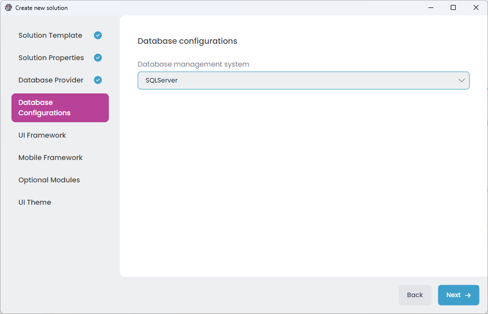
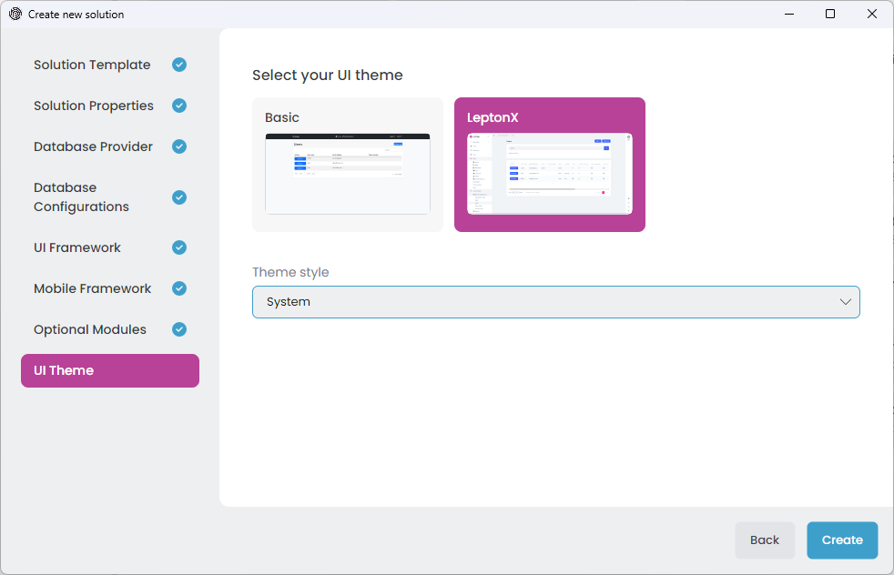
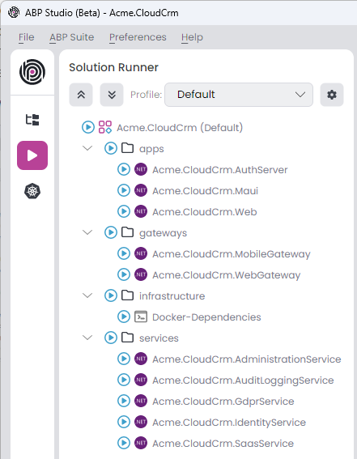

# Quick Start: Creating a Microservice Solution with ABP Studio

Welcome to ABP Studio. In this quick start guide, you will learn how to create and run a microservice solution using ABP Studio.

## Creating a New Solution

> ABP Commercial startup solution templates have many options for your specific needs. If you don't understand an option that probably means you don't need it. We selected common defaults for you, so you can leave these options as they are.

Assuming that you have [installed and logged in](../installation.md) to the application, you should see the following screen when you open ABP Studio:

Select the *File* -> *New Solution* in the main menu, or click the *New solution* button on the *Welcome* screen to open the *Create new solution* wizard:

We will use the *Microservice* solution template for this tutorial, so pick it and click the *Next* button:

In that screen, you choose a name for your solution. You can use different level of namespaces; e.g. `CloudCrm`, `Acme.CloudCrm` or `Acme.Solutions.CloudCrm`.

Then select an *output folder* to create your solution. The *Create solution folder* option will create a folder in the given output folder with the same name of your solution.

Once your configuration is done, click the *Next* button to navigate to the *Database Provider* selection:

On that screen, you can decide on your database provider by selecting one of the provided options, then click the *Next* button to navigate to the *Database Configurations* section (only for Entity Framework Core):

Here, select the DBMS right for you, then click the *Next* button to navigate to the *UI Framework* selection:

Here, you see all the possible UI options supported by that startup solution template. You can pick your favorite one and click the *Next* button for the *Mobile Framework* selection screen:

Here, you see all the mobile applications available in that startup solution template. These mobile applications are well-integrated to your solution and can use the same backend with your web application. They are simple (not have pre-built features as much as the web application) but a very good starting point to build your mobile application.

> If you select a mobile application, an additional API Gateway is created that is only used by the mobile application. 

Pick the one best for you, or select the *None* if you don't want a mobile application in your solution, then click *Next* to navigate to the *Optional Modules* section:

Each item in that list is a pre-built application module. You can click the blue icon near to the module name to get more information about the module. You can leave the list as is (so, it installs the most common and used modules for you) or customize based on your preference.

> ABP Studio creates dedicated microservices for some of the modules (e.g. SaaS and GDPR). For others (e.g. Language Management and OpenIddict UI), it installs the modules into existing microservices. So, you may not see a separate service for each selected module.

Installing a module after creating the solution may require manual steps. So, it is better to decide the modules in the beginning. You can create an example solutions before your real solution to explore the solution and modules.

Once you select the desired modules, click the *Next* button for the *UI Theme* selection:

LeptonX is the suggested UI theme that is proper for production usage. Select one of the themes and configure additional options if you want.

Now, we are ready to allow ABP Studio to create our solution. Just click the *Create* button and let it go. After clicking the Create button, the dialog is closed and your solution is loaded into ABP Studio:

You can explore the solution, but you need to wait for background tasks to be completed before running any application in the solution (it can take up to a few minutes to set up all).

> The solution structure can be different in your case based on the options you've selected.

## Exploring the Solution

This solution consists of several modules shown in the *Solution Explorer* section:

> You can refer the *[Concepts](../concepts.md)* document to learn what do solution and module terms mean.

Each leaf item (e.g. `Acme.CloudCrm.IdentityService` or `Acme.CloudCrm.Web`) in the tree above is an ABP Studio module. They are grouped into solution folders (`apps`, `gateways` and `services`).

Each module has a separate .NET Solution. You can open a module's (or .NET solution's) folder by right-clicking a module in the *Solution Explorer* tree, select *Open with* -> *Explorer* option as shown below:

If we open the `Acme.CloudCrm.IdentityService` module's path in the explorer, we can see its .NET solution and other files:

This microservice solutions is designed to have separate .NET solutions for each service to make it possible to develop independently from the other services and applications.

You can open any module's .NET solution in your favorite IDE and make your development. The following figure is a screenshot from the *Identity* microservice opened in Visual Studio:

If you explore that .NET solution, you will typically see some configuration code, and you won't see any business code. That's because the solution uses [pre-built application modules](../../modules/index.md) as NuGet packages, and doesn't contain their source code. In this way, you can easily upgrade these application modules when a new version is available.

You will typically add new microservices to the solution and perform your business logic inside these new services (however, you can always want to download source code of any pre-built application module and include it into your solution to freely customize it).

## Running the Solution

Running a microservice solution is not like running a monolith application where you typically have a single executable. All the applications, services, gateways and infrastructure components (e.g. Redis, RabbitMQ) should be up and running. Fortunately, ABP Studio provides the *Solution Runner* and *Kubernetes Integration* features to make it easy and enjoyable.

Open the *Solution Runner* section on the left side of ABP Studio as shown in the following figure:

Once you click the *Play* icon on the left side, the section is open in the same place of the *Solution Explorer* section. ABP Studio also opens the *Application Monitor* view on the main content area. *Application Monitor* shows useful insights for your applications/services (e.g. *HTTP Request*, *Events* and *Exceptions*) as real-time. You can use it to see the happenings in your system, so you can easily track errors and many helpful details.

In the *Solution Runner* section (on the left side) you can see all the runnable applications in the current solution:

> All the leaf items in the *Solution Runner* is called as an *Application* as they are executable applications.

As shown in the figure above, the executable applications are grouped into folders like `apps`, `gateways`, `infrastracture` and `services`. You can start/stop them all, a group (folder) of them or one by one.

Before running the applications, it is good to be sure that all applications are built. To do that, right-click the root item in the *Solution Runner* and select *Build* -> *Build All* action.

> *Solution Runner* doesn't build an application before running it. That provides a great performance gain, because most of the time you will work on one or a few services and you don't need to build all of the other applications in every run. However, if you want to build before run, you can right-click an item in the *Solution Runner* tree and select *Run* -> *Build & Start* command.

It will take some time to build all. Once all ready, you can...
