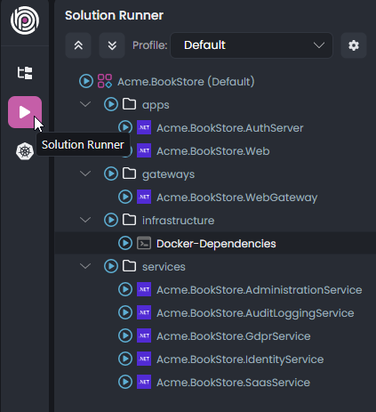
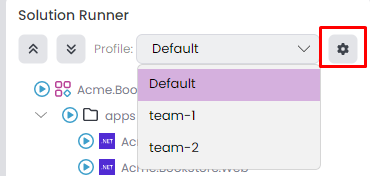
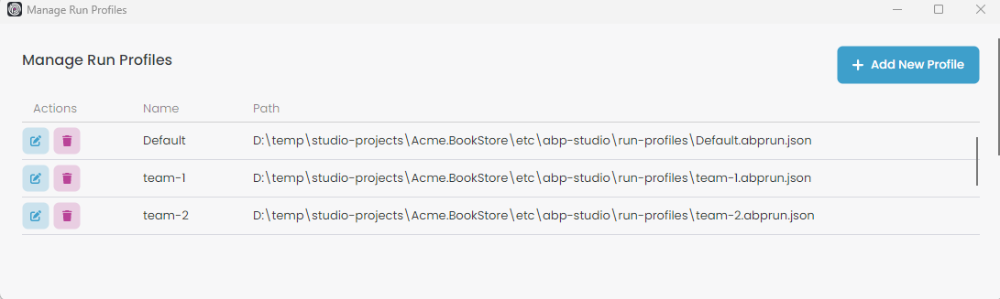
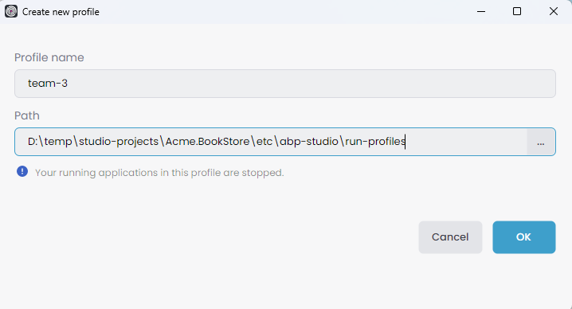

# Running Applications Using ABP Studio Solution Runner

Running application in ABP Studio is a straightforward process to start one or more applications easier. Navigate to the **Solution Runner** pane located in the left menu.

> The project structure might vary based on your selection. In an MVC microservice project, looks like the following;

The solution runner contains 4 different types to define tree structure.
- **Profile root** - `Acme.BookStore (Default)`.
- **Folder** - `apps`, `gateways`, `infrastructure`, `services`. 
- **C# Application** `Acme.BookStore.AuthServer`, `Acme.BookStore.Web`, `Acme.BookStore.WebGateway`, etc...
- **CLI Application** `Docker-Dependencies`

## Profile

We can add or remove profiles to define different profile roots, which is provide us to organize our tree structure as needed. The *Default* profile comes with the project creation, includes all projects in the tree to manage at once. You can view all profiles in the combobox and change the current profile. To edit, click the gear icon located on the right side.

It opens the *Manage Run Profiles* window. You can edit/delete existing profiles or add a new one.

When you click *Add New Profile*, it opens the *Create New Profile* window. You can provide an arbitrary profile name, which should only contain letters, numbers, underscores, dashes, and dots in the text. When you create a new profile, it stores the JSON file at the specified path. You can specify the path `abp-solution-path/etc/abp-studio/run-profiles` to adhere to the standard format. You can click *Ok* button to save profile.

> You can change the current profile while applications are running in the previous profile. The applications continue to run under the previous profile. For example if we start the `Acme.BookStore.AdministrationService`, `Acme.BookStore.IdentityService` applications when current profile is *team-1* and after change the current profile to *team-2* the applications continue to run under *team-1*.

> When a profile is deleted while running some applications, those applications will be stopped. If the current profile is edited while running some applications, only the applications associated with the edited profile will be stopped. However, applications running under a different profile will continue to run unaffected. Lastly if we add a new profile then all profiles runned applications gonna be stopped.
