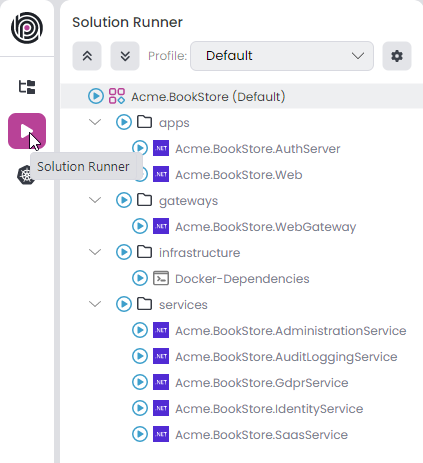

# Running Applications Using ABP Studio Solution Runner

Running application in ABP Studio is a straightforward process to start one or more applications easier. Navigate to the **Solution Runner** panel located in the left menu.

> The project structure might be different based on your selection. In an MVC microservice project, looks like the following;

The solution runner contains 4 different types to define tree structure.
- **Profile root** - `Acme.BookStore (Default)`.
- **Folder** - `apps`, `gateways`, `infrastructure`, `services`. 
- **C# Application** `Acme.BookStore.AuthServer`, `Acme.BookStore.Web`, `Acme.BookStore.WebGateway`, etc...
- **CLI Application** `Docker-Dependencies`

## Profile

We can add or remove profiles to define different profile roots, which is provide us to organize our tree structure as needed. We can collapse or expand the entire tree using the up and down arrow icons. The *Default* profile comes with the project creation, includes all projects in the tree to manage at once. You can view all profiles in the combobox and change the current profile. To edit, click the gear icon located on the right side.

It opens the *Manage Run Profiles* window. You can edit/delete existing profiles or add a new one.

When you click *Add New Profile*, it opens the *Create New Profile* window. You can provide an arbitrary profile name, which should only contain letters, numbers, underscores, dashes, and dots in the text. When you create a new profile, it stores the JSON file at the specified path. You can specify the path `abp-solution-path/etc/abp-studio/run-profiles` for microservice projects or `abp-solution-path/etc/run-profiles` for other project types to adhere to the standard format. Click *OK* button to save profile.

> You can change the current profile while applications are running in the previous profile. The applications continue to run under the previous profile. For example if we start the `Acme.BookStore.AdministrationService`, `Acme.BookStore.IdentityService` applications when current profile is *team-1* and after change the current profile to *team-2* the applications continue to run under *team-1*.

> When a profile is deleted while running some applications, those applications will be stopped. If we edit a profile while running some applications, only the applications associated with the edited profile will be stopped. However, applications running under a different profile will continue to run unaffected. Lastly if we add a new profile then all profiles runned applications gonna be stopped.

## Profile Root

After selecting the current profile, which is *Default* comes out of the box we can utilize the *Profile Root*. This allows us to execute collective commands and create various tree structures based on our specific needs. You can navigate to the profile root and right-click to view the context menu, which includes 3 options `Run`, `Build` and `Add`.

### Run

*Profile Root* -> *Run* context menu, there are 3 options available:

- `Start All`: Start all(CLI, C#) applications.
- `Stop All`: Stop all(CLI, C#) applications.
- `Build & Start All`: It builds each C# applications using the [dotnet build](https://learn.microsoft.com/en-us/dotnet/core/tools/dotnet-build) command in the [Background Tasks](./overview/index.md#background-tasks) and starts all(CLI, C#) applications after the build tasks are completed.

### Build

*Profile Root* -> *Build* context menu, there are 4 options available:

- `Build All`: It builds each C# applications using the [dotnet build](https://learn.microsoft.com/en-us/dotnet/core/tools/dotnet-build) command in the [Background Tasks](./overview/index.md#background-tasks).
- `Graph Build`: It builds each C# applications using the [dotnet build](https://learn.microsoft.com/en-us/dotnet/core/tools/dotnet-build) command with [graphBuild](https://learn.microsoft.com/en-us/visualstudio/msbuild/build-process-overview?view=vs-2022#graph-option) option in the [Background Tasks](./overview/index.md#background-tasks).
- `Restore`: It restores each C# applications using the [dotnet restore](https://learn.microsoft.com/en-us/dotnet/core/tools/dotnet-restore) command in the [Background Tasks](./overview/index.md#background-tasks).
- `Clean`: It cleans each C# applications using the [dotnet clean](https://learn.microsoft.com/en-us/dotnet/core/tools/dotnet-clean) command in the [Background Tasks](./overview/index.md#background-tasks).

### Add

We can add 3 different item type to *Profile Root* for defining the tree structure. Those options are `C# Application`, `CLI Application` and `Folder`.

#### C# Application

When we click the *Profile Root* -> *Add* -> *C# Application* it opens the *Add Application* window. We would be able to add two different way. You can add C# application in *This solution* tab with following way:

- `Select application`: First we have to select an application, you have the option to add the same application multiple times.
- `Name`: Give an arbitrary name to see in solution runner. This name should be unique even the selected application already exists.
- `Launch url`: Is the url when we want to browse.
- `Kubernetes service`: If you're not using the *Kubernetes* panel leave it empty. But if solution template is the [microservice](./solution-templates/microservice/index.md) we should give the correct pattern. It's necessary for *Browse* when we connect the kubernetes cluster we should browse the services instead *Launch url*. You can copy the existing C# application *Kubernetes sevice* value.

