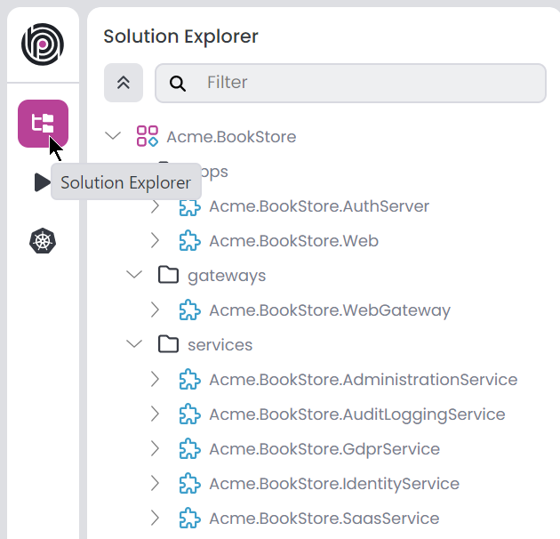
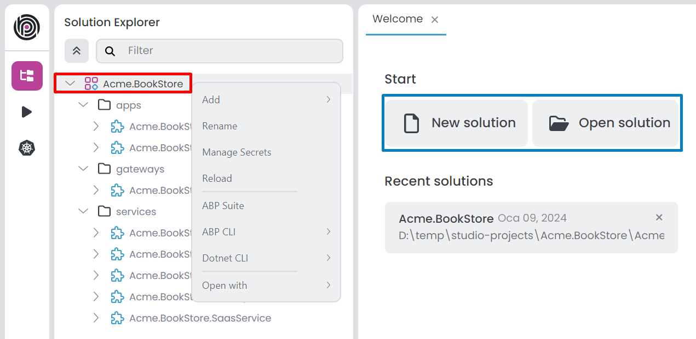
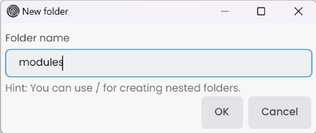
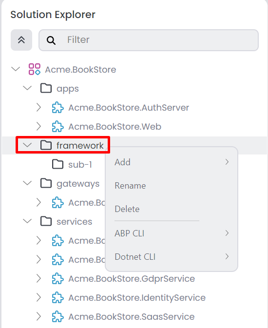
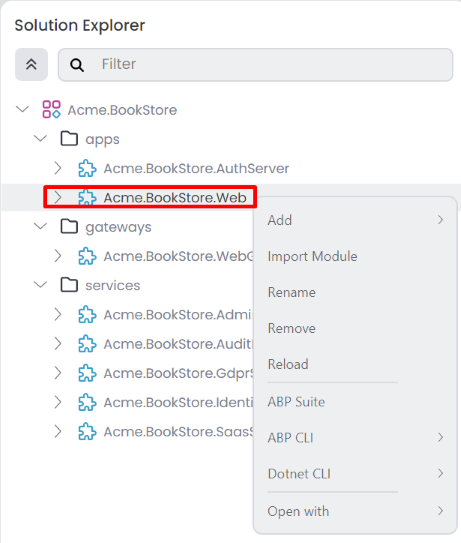
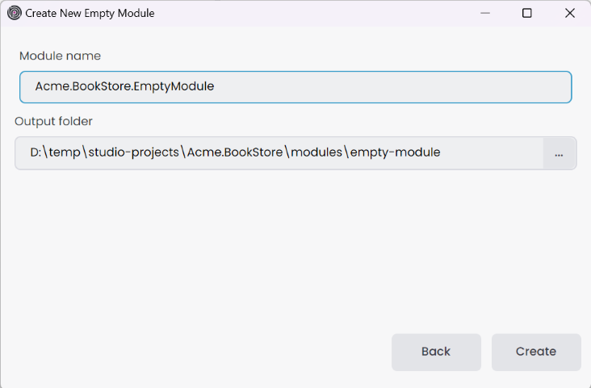
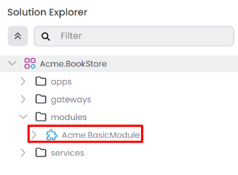
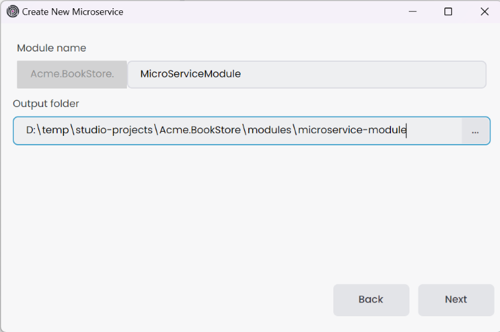
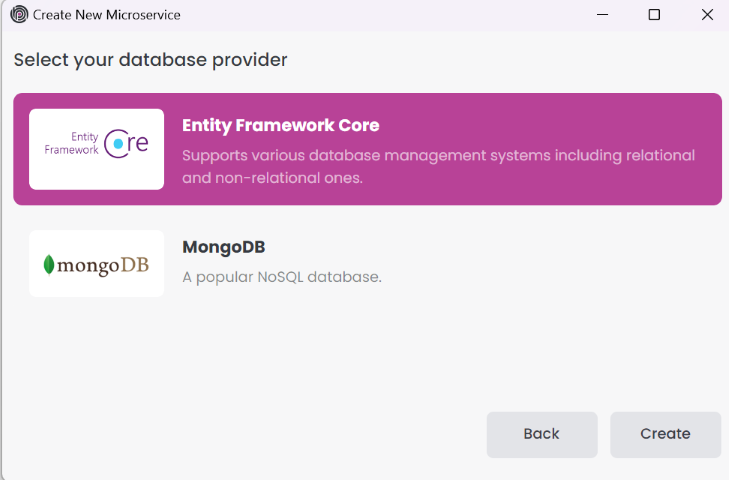
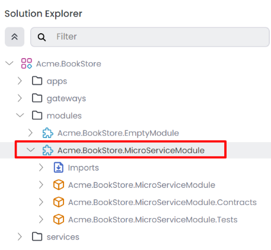

# ABP Studio: Solution Explorer

ABP Studio incorporates various [concepts](./concepts.md) and we're using them in the solution explorer. To ensure clarity, please review the [concepts](./concepts.md) documentation first. You can see the *Solution Explorer* on the left side of the ABP Studio. It displays an overview of your solution, you can manage your projects using the solution explorer. Simply navigate to the *Solution Explorer* panel in the left menu.

> The solution explorer structure might be different based on your selection. For example MVC microservice project, looks like the following. You can edit modules, packages and folders from the solution explorer.

## Solution

It is the main solution that you can open with ABP Studio, an ABP solution can contain multiple [modules](./concepts.md#module). You can create a new ABP solution using the *New solution* button on the welcome page. You can also open an existing ABP solution using the *Open solution* button on the welcome page. You can edit *Modules* and *Folders* using the root of the solution. Additionally, the solution explorer allows you to filter by *Folder*, *Module*, *Package* and *Imports*. We can collapse the entire tree using the up arrow icon.  When you right-click the root of the solution, it opens the context-menu you can see the following options;

- `Add`: You can add following options to your solution;
  - `New Folder`: Creates a new folder within the ABP Solution, allowing you to organize your modules.
  - `New Module`: Allows you to create a new module.
  - `Existing Module`: You can add existing module to your solution.
- `Rename`: Renames the solution.
- `Manage Secrets`: You can edit your solution secrets.
- `Reload`: Reloads the solution.
- `ABP Suite`: It opens the *Choose Module* window and you can select a module or continue without selecting a module. If you select a module, it will open the module in the ABP Suite. If you continue without selecting a module, it will open the ABP Suite without a module.
- `ABP CLI`
  - `Install Libs`: Install NPM Packages for UI projects in your solution.
  - `Upgrade ABP Packages`: Update all the ABP related NuGet and NPM packages in your solution.
  - `Clean`: Deletes all `BIN` and `OBJ` folders in your solution.
  - `Swith to`: It is switch your solution to the selected version of the ABP framework.
    - `Stable`: Switches your solution to the latest stable version.
    - `Preview`: Switches your solution to the preview version.
    - `Nightly Build`: Switches your solution to the nightly version.
- `Dotnet CLI`
  - `Build`: Builds each modules.
  - `Graph Build`: Builds each modules with [graphBuild](https://learn.microsoft.com/en-us/visualstudio/msbuild/build-process-overview?view=vs-2022#graph-option) option.
  - `Clean`: Cleans the output of the previous build for modules.
  - `Restore`: Restores the dependencies for modules.
- `Open With`
  - `Terminal`: Opens the terminal in the solution directory.
  - `Explorer`: Opens the file explorer in the solution directory.

## Folder

When adding modules directly to the root of the solution, it can become disorganized, especially with numerous modules. Utilizing a folder structure allows us to organize modules more efficiently. This method enables executing collective commands within a specified folder. You can create a new folder using the *Add* -> *New Folder* button on the root of the solution context-menu it opens *New folder* window. You can also rename, delete, and move folders using the solution explorer.

- `Folder name`: Give the folder name that we wanna see in solution explorer. We can create nested folder with `/` character. This is a solution explorer folder so, it doesn't create a real folder. Ensure each folder name is unique.

You can click the *OK* button to add the folder to the solution. When you right-click the solution folder, it opens the context-menu you can see the following options;

- `Add`: You can add following options to your solution folder;
  - `New Folder`: Creates a new nested folder within the selected folder, allowing you to organize your modules.
  - `New Module`: Allows you to create a new module to selected folder.
  - `Existing Module`: You can add existing module to your selected folder.
- `Rename`: Renames the selected folder.
- `Delete`: Deletes the selected folder and all child items from the solution.
- `ABP CLI`
  - `Install Libs`: Install NPM Packages for UI projects in your selected folder.
  - `Upgrade ABP Packages`: Update all the ABP related NuGet and NPM packages in your selected folder.
  - `Swith to`: It switches your selected folder to the specified version of the ABP framework.
    - `Stable`: Switches your selected folder to the latest stable version.
    - `Preview`: Switches your selected folder to the preview version.
    - `Nightly Build`: Switches your selected folder to the nightly version.
  - `Clean`: Deletes all `BIN` and `OBJ` folders in your selected folder.
- `Dotnet CLI`
  - `Build`: Builds each modules in your selected folder.
  - `Graph Build`: Builds each modules with [graphBuild](https://learn.microsoft.com/en-us/visualstudio/msbuild/build-process-overview?view=vs-2022#graph-option) option in your selected folder.
  - `Clean`: Cleans the output of the previous build for modules in your selected folder.
  - `Restore`: Restores the dependencies for modules in your selected folder.

> You can drag and drop folders, modules and packages (within the same module) into a folder for organization purposes. Click and hold an item, then drag it into the desired folder.

## Module

A [module](./concepts.md#module) is a sub-solution that can contains zero, one or multiple [packages](./concepts.md#package). Each module is considered a .NET solution. We can add or import an existing module to the solution, with each module only able to be added once. When you right-click the module, it opens the context-menu where you can see the following options:

- `Add`: You can add following options to your module;
  - `Package`:
    - `New Package`: Creates a new package within the selected module.
    - `Existing Package`: You can add existing package to your selected module.
  - `Folder`: Creates a new folder within the selected module, allowing you to organize your packages.
- `Import Module`: This option allows you to import an existing module from *Solution*, *Local*, or *NuGet* into your selected module.
- `Rename`: Renames the selected module.
- `Remove`: Removes the selected module and all child items from the solution.
- `Reload`: Reloads the selected module.
- `ABP Suite`: It will open the selected module in the ABP Suite.
- `ABP CLI`
  - `Install Libs`: Install NPM Packages for UI projects in your selected module.
  - `Upgrade ABP Packages`: Update all the ABP related NuGet and NPM packages in your module.
  - `Swith to`: It switches your selected module to the specified version of the ABP framework.
    - `Stable`: Switches your selected module to the latest stable version.
    - `Preview`: Switches your selected module to the preview version.
    - `Nightly Build`: Switches your selected module to the nightly version.
  - `Clean`: Deletes all `BIN` and `OBJ` folders in your selected module.
- `Dotnet CLI`
  - `Build`: Builds your selected module.
  - `Graph Build`: Builds selected module with [graphBuild](https://learn.microsoft.com/en-us/visualstudio/msbuild/build-process-overview?view=vs-2022#graph-option) option.
  - `Clean`: Cleans the output of the previous build for selected module.
  - `Restore`: Restores the dependencies for selected module.
- `Open With`
  - `Visual Studio`: Opens the module in Visual Studio. This option is only available if you have Visual Studio installed.
  - `Visual Studio Code`: Opens the module in Visual Studio Code. This option is only available if you have Visual Studio Code installed.
  - `JetBrains Rider`: Opens the module in JetBrains Rider. This option is only available if you have JetBrains Rider installed.
  - `Terminal`: Opens the terminal in the module directory.
  - `Explorer`: Opens the file explorer in the module directory.

### Adding a New Empty Module

Create a new module by clicking the *Add* -> *New Module* button at the root of the solution or in the folder context-menu. This action opens the *Create New Module* window. Choose between two module templates: *Empty* and *Microservice (service-nolayers)*. Please note that these options are only available for *Microservice* solution template. Other solution templates, such as *Application (Layered)*, can only create an empty module.

If you choose the *Empty Module*, provide the *Module name* and *Output folder*, then click the *Create* button to add the empty module to the solution. For solution templates other than *Microservice*, the *Create New Module* window opens directly to this step.

After creating the empty module, it will be added to the solution, and you should see the following structure in the solution explorer.

### Adding a New Microservice Module

Similar to creating an empty module, if you select the *Microservice (service-nolayers)* module template, provide the *Module name* and *Output folder*, then click the *Next* button. Please note that the *Module name* includes the solution name as a prefix, and the use of the dot(.) character in the *Module name* is not allowed.

You can choose the database provider for your microservice module. Select one of the following options:

After creating the *Microservice (service-nolayers)* module, it will be added to the solution, and you should see the following structure in the solution explorer.

> To customize the *Microservice (service-nolayers)* module template, navigate to the solution folder, where you'll find a `_templates` folder. You can edit the `service_nolayers` template based on your specific needs.

### Adding an Existing Module

ABP modules have their own file extension `.abpmdl`, and they are located in the specific module folder once created. Similar to creating a C# project in a solution and adding it to another solution as an existing project, you can create an ABP module in one solution and add it to another solution as an existing module. To add an existing module to your solution, use the *Add* -> *Existing Module* button at the root of the solution or in the folder context-menu. This action opens the *Select an ABP module file* window. Choose the module you want to add to the solution, then click the *Open* button.

> The added module can be located outside of the solution folder. The path will be [normalized](https://learn.microsoft.com/en-us/dotnet/standard/io/file-path-formats#path-normalization), allowing flexibility in the module's location as long as it's accessible from the current [ABP Solution](./concepts.md#solution) path.

### Difference Between ABP Framework Module Template and ABP Studio Module Approach

In ABP Framework, creating a module solution using the [CLI](https://docs.abp.io/en/commercial/latest/startup-templates/module/creating-a-new-solution) results in a solution with numerous projects, some of which may not be necessary for a specific use case. The ABP Studio module approach differs from the ABP Framework module template, offering greater flexibility. With ABP Studio, we can create a module containing only the required projects; for example, an empty module with only the `Domain` and `Application` projects. In this approach, the term [Package](./concepts.md#package) is used for module projects.

Furthermore, it's important to mention that we can create not just DDD-principled modules. The [Modularity](https://docs.abp.io/en/abp/latest/Module-Development-Basics) document clarifies the difference between *Framework* and *Application* modules. Basically, every C# project refers to the `Volo.Abp.Core` package and defines the *Module* class as an ABP Class Library. We have the option to develop an infrastructure module using only the *ABP Class Library* packages and provide a module reference to other modules.

## Imports

## Packages