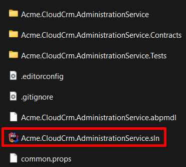
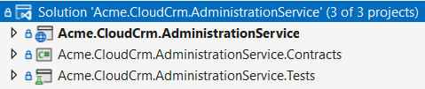
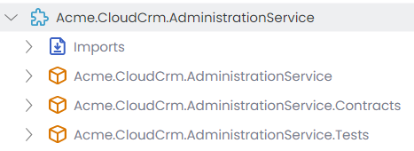

# ABP Studio Microservice Solution: Microservices

The ABP Studio Microservice solution consists of a few microservices at the beginning. It is expected that you [add more microservices](guides/add-new-microservice.md) as your solution grows. This document briefly explains the structure of pre-built microservices in the solution.

The microservice count varies based on the options you've selected during the solution creation. However, the following microservices are always included:

* **Administration** microservice is used to manage permissions, languages and other fundamental settings of the system.
* **Identity** microservice is used to manage users, roles and their permissions. It basically serves to the [Identity](../../../modules/identity.md) module's UI (and [OpenIddict](../../../modules/openiddict.md) module's UI, if selected).

In the next section, you will learn the fundamental solution structure that is applied to all the microservices.

## Solution Structure of Microservices

All of the pre-built microservices are built with the same solution structure. This section explains that common solution structure and general decisions we've taken while designing that structure.

First of all, **every microservices has its own .NET solution**. In this way, you can independently develop, version, build and deploy it. You can even move a microservice to a different repository in your source control system since it has no dependency to other parts of the solution.

Microservice solutions are located under the `services` folder of the root solution folder. For example, if you open the `services/administration` folder, you will see the following folders and files:

Every microservice solution consists of three .NET projects. The following figure shows the Administration microservice in Visual Studio:

Lets's explain the projects:

* `Acme.CloudCrm.AdministrationService` is the main executable application that hosts the microservice. It contains everything (entities, repositories, services, controllers, database configuration and migration, etc) related to that microservice.
* `Acme.CloudCrm.AdministrationService.Contracts` contains service interfaces and data transfer objects of your service. It is useful to separate contracts. In this way, you can share the *Contracts* package with the clients, so they can easily consume your services. See the [communication](communication.md) document to learn how to do it.
* `Acme.CloudCrm.AdministrationService.Tests` contains the unit and integration tests for that microservice. While it is highly suggested to build tests for your services, you can delete that project if you don't want to write tests.

> We haven't applied **layering** for the pre-built microservices, because they don't include much code and no need for such complexity. Microservices should be small (micro!) services, so you typically can manage your codebase in a single project/layer. However, if you want to implement layering for your microservices, you can create a layered microservice by following the *[Adding New Microservice](guides/add-new-microservice.md)* guide.

Next sections introduces and explains the pre-build services.

## Pre-Built Microservices

### Administration Microservice

