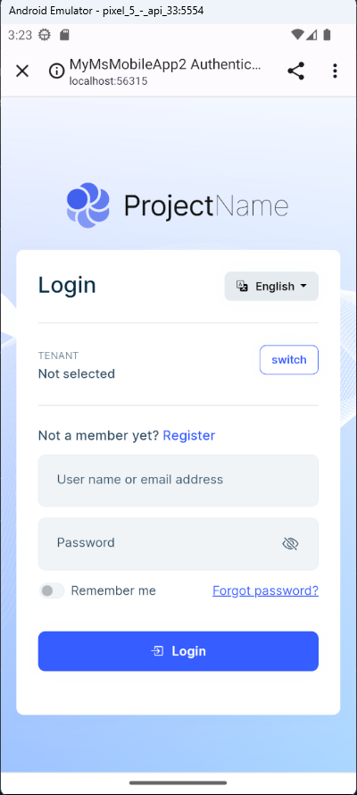

# Microservice Solution: Mobile Applications

The ABP Studio microservice solution template comes with an optional mobile application that is completely integrated to the solution. There are two options for the mobile application:

* MAUI
* React Native

You can select the mobile application type while [creating your solution](../../quick-starts/microservice.md).

## Fundamental Structures

The following sections explain the common structure of the mobile applications (valid for both of MAUI and React Native applications).

### The Mobile Gateway

If you've selected to include the mobile application into your solution, an API Gateway, named `MobileGateway` is also added to the solution. It is located under the `gateways/mobile` in the solution folder.

You can refer to the *[API Gateways](api-gateways.md)* document to understand the structure of the mobile gateway.

### Authentication

Both of the MAUI and React Native applications are installed as native applications to the devices. So, they are using the [OpenID Connect](../../../modules/openiddict.md) protocol to authenticate the users. The authentication is done by the `AuthServer` application.

They don't run on a browser, so they can't use the [Cookie Authentication](../../../modules/account.md#cookie-authentication) method. They are using the [JWT Bearer Authentication](../../../modules/account.md#jwt-bearer-authentication) method. 

Best way to communicate with the `AuthServer` application is using the browser. So, the mobile applications are opening a browser window to authenticate the user. Then browser redirects back to the mobile application with the authentication result.

The following screenshot was taken from the *Login* page of the [Account](../../../modules/account.md) module in the mobile application's UI:

)


### User Management

User Management is implemented in the MAUI Application in the `Acme.CloudCrm.Maui` project with XAML and C# for MAUI and it is implemented in the React Native Application in the react-native project for React Native UI option.


### Profile Management

Profile management allows users to view and update their personal profile picture and their passwords. It provides a seamless experience for users to manage their profiles within the mobile application without navigating to the authserver web application.

The following screenshot was taken from the *Profile* page in the MAUI application:


### Other Features

#### Settings Page
The settings page allows users to change the language and theme of the application, manage their profiles, change their passwords, and also to logout from the application.


- **Language**: Applications implements ABP localization logic on the platforms. The language is automatically selected based on the device's language. Users can also change the language manually from the settings page. 

- **Dark/Light Theme**: ABP MAUI and React Native applications support both dark and light themes. The theme is automatically selected based on the device's theme. Users can also change the theme manually from the settings page.

## Applications

Following sections explain the structure of MAUI and React Native Applications.

### The MAUI Application

This is the mobile application that is built based on Microsoft's [MAUI framework](https://learn.microsoft.com/en-us/dotnet/maui). It will be in the solution only if you've selected the MAUI as your mobile application option.

#### Project Structure
Entire MAUI application is built on the AppShell pattern of MAUI. You can find the AppShell class in the `Acme.CloudCrm.Maui` project. It is the entry point of the application. It is responsible for initializing the application and registering the services. You find all the pages and routing information in the `AppShell.xaml` file.

- **Pages**: Pages are located in the `Pages` folder of the project. Each page has a XAML & C# file. XAML file is responsible for the UI and C# file is responsible for the initialization of the page.

- **ViewModels**: ViewModels are located in the `ViewModels` folder of the project. Each ViewModel has a C# file. ViewModels are responsible for the business logic of the pages.

- **Oidc**: Oidc folder contains the logic for the authentication of the application. It contains the `MauiAuthenticationBrowser` class which manages the authentication process of the application.

- **Localization**: Localization folder contains the localization logic of the application. It contains regular ABP Localization logic and the `LocalizationResourceManager` class which is wrapper for the ABP localization logic on MAUI.

- **Messages**: Messages folder contains the message data for the communication inside application. Messages are used to send data between pages and viewmodels. It's designed on the [MVVM Toolkit Messenger](https://learn.microsoft.com/en-us/dotnet/communitytoolkit/mvvm/messenger) feature.

- **Storage**: Storage folder contains the storage logic of the application. It contains the `IStorage` class which is wrapper for the [SecureStorage](https://learn.microsoft.com/en-us/dotnet/maui/platform-integration/storage/secure-storage) feature. It is used to store the authentication data of the user and preferences of the application.

_Rest of the folders are MAUI default folders. You can check the [.NET MAUI single project documentatipon](https://learn.microsoft.com/en-us/dotnet/maui/fundamentals/single-project?view=net-maui-8.0) for more information._

#### Running the application
Before running the MAUI Application, rest of the applications in the solution must be running. Such as AuthServer, MobileGateway and the microservices. 

Make sure that you prepared devices for debugging. You can check the following documentation for each platform.

- [Android](https://learn.microsoft.com/en-us/dotnet/maui/android/emulator/)
- [iOS](https://learn.microsoft.com/en-us/dotnet/maui/ios/pair-to-mac)
- [MacCatalyst](https://learn.microsoft.com/en-us/dotnet/maui/mac-catalyst/cli)
- [Windows](https://learn.microsoft.com/en-us/dotnet/maui/windows/setup)

##### Network

All the platforms including iOS, MacCataylst and Windows, runs the applications in the same network of the host. So, you can use the `localhost` address to connect to the applications.

But in the **Android Emulator**, you need to use the `adb reverse` command to connect to the applications. You can use the following command to connect to the AuthServer application:

```bash
adb reverse tcp:44300 tcp:44300
```

> `44300` is an example port. You need to change it based on the port of the AuthServer & MobileGateway application.

> You need to run the command for a running emulator. If you run the emulator after running the command, you need to run the command again.


##### Target Framework

Since MAUI Applications have multiple target frameworks, you need to select the target framework before running the application. You can select the target framework from the context menu of the Solution Runner.


##### Running with ABP Studio
You can start the MAUI application with the solution runner. You can click the start button of the MAUI application in the solution runner tree. It will start the application on the selected target framework. Since they're not running on a process and they're running on a device, you can't see them as running state in the solution runner. After the application is deployed, it'll be opened on the device and it'll be shown as stopped in the solution runner.

---

#### Development on MAUI Application

You can follow [Mobile Application Development Tutorial - MAUI](https://docs.abp.io/en/commercial/latest/tutorials/book-store/mobile/maui) to learn how to develop on MAUI Application.

### The React Native Application

This is the mobile application that is built based on Facebook's [React Native framework](https://reactnative.dev/). It will be in the solution only if you've selected React Native as your mobile application option.

TODO: Project structure, running the application, debugging, development hints, link to the [tutorial](https://docs.abp.io/en/commercial/latest/tutorials/book-store/mobile/react-native) etc.