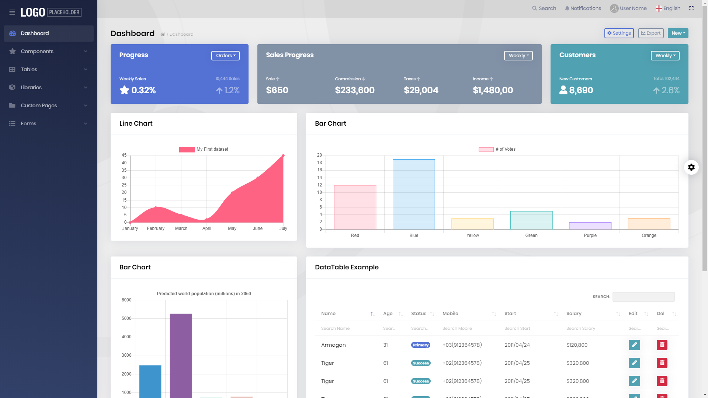

# ABP Commercial Official Themes
ABP Commercial provides official themes for ABP Commercial. You can use these themes in your applications.

## Lepton Theme

The Lepton Theme is a professional theme for the ABP Commercial.

* Built on the [Bootstrap 5](https://getbootstrap.com) library.
* 100% compatible with  [Bootstrap 5](https://getbootstrap.com) HTML structure and CSS classes
* Responsive & mobile-compatible.
* Provides different style like Material, Dark, Light.
* Provides styles for [Datatables](https://datatables.net).

A screenshot from the light style of the theme:

> [See all the theme styles and create a demo to see it in action](https://commercial.abp.io/themes).

## LeptonX Theme
[LeptonX Theme](https://x.leptontheme.com/) is a new generation theme of Lepton Theme. It's includes all the features of Lepton Theme and more. It comes with ABP Commercial.

* Check out the website of LeptonX on https://leptontheme.com/
* Check out the live demo to see it in action. https://x.leptontheme.com/

### Highlights

* Built on the [Bootstrap 5](https://getbootstrap.com) library.
* 100% compatible with  [Bootstrap 5](https://getbootstrap.com) HTML structure and CSS classes
* Responsive & mobile-compatible.
* Provides different style like Dim, Dark and Light.

A screenshot from the light style of the theme:

> [See all the theme styles and create a demo to see it in action](https://commercial.abp.io/themes).

- [LeptonX for MVC](lepton-x/commercial/mvc.md)
- [LeptonX for Blazor](lepton-x/commercial/blazor.md)
- [LeptonX for Angular](lepton-x/commercial/angular.md)