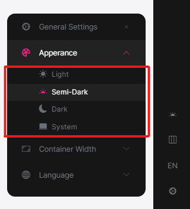
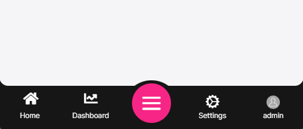

# LeptonX Blazor UI

````json
//[doc-params]
{
    "UI": ["Blazor", "BlazorServer"]
}
````

LeptonX theme is implemented and ready to use with ABP Commercial. No custom implementation is needed for Blazor Server & WebAssembly.

## Installation

{{if UI == "Blazor"}}

- Add **Volo.Abp.AspNetCore.Components.WebAssembly.LeptonXTheme** package to your **Blazor WASM** application.
  ```bash
  dotnet add package Volo.Abp.AspNetCore.Components.WebAssembly.LeptonXTheme --prerelease
  ```

- Remove old theme from **DependsOn** attribute in your module class and add **AbpAspNetCoreComponentsWebAssemblyLeptonXThemeModule** type to **DependsOn** attribute.

```diff
[DependsOn(
-    typeof(LeptonThemeManagementBlazorModule),
-    typeof(AbpAspNetCoreComponentsWebAssemblyLeptonThemeModule),
+    typeof(AbpAspNetCoreComponentsWebAssemblyLeptonXThemeModule)
)]
```

- Change startup `App` component with the LeptonX one.
  - Add following using declaration and remove your old theme using declaration.
    ```csharp
    using Volo.Abp.AspNetCore.Components.Web.LeptonXTheme.Components;
    ```

  - Make sure `App` component in following block is `Volo.Abp.AspNetCore.Components.Web.LeptonXTheme.Components.App`
    ```csharp
        // Make sure the 'App' comes from 'Volo.Abp.AspNetCore.Components.Web.LeptonXTheme.Components' namespace.
        builder.RootComponents.Add<App>("#ApplicationContainer");
    ```
    - If you can't remove or not sure which one is the old theme's using statements, you can use full name of that class:
        ```csharp
        builder.RootComponents.Add<Volo.Abp.AspNetCore.Components.Web.LeptonXTheme.Components.App>("#ApplicationContainer");
        ```

{{end}}


{{if UI == "BlazorServer"}}

- Complete [MVC Installation steps](mvc.md#installation) first.

- Add **Volo.Abp.AspNetCore.Components.Server.LeptonXTheme** package to your **Blazor Server** application.
  ```bash
  dotnet add package Volo.Abp.AspNetCore.Components.Server.LeptonXTheme --prerelease
  ```
- Remove old theme from **DependsOn** attribute in your module class and add **AbpAspNetCoreComponentsServerLeptonXThemeModule** type to **DependsOn** attribute.

    ```diff
    [DependsOn(
    -    typeof(LeptonThemeManagementBlazorModule),
    -    typeof(AbpAspNetCoreComponentsServerLeptonThemeModule),
    +    typeof(AbpAspNetCoreComponentsServerLeptonXThemeModule)
    )]
    ```

- Update AbpBundlingOptions
  ```diff
  options.StyleBundles.Configure(
  - BlazorLeptonThemeBundles.Styles.Global,
  + BlazorLeptonXThemeBundles.Styles.Global,
    bundle =>
    {
        bundle.AddFiles("/blazor-global-styles.css");
        //You can remove the following line if you don't use Blazor CSS isolation for components
        bundle.AddFiles("/MyProjectName.Blazor.styles.css");
    });
  ```

- Update `_Host.cshtml` file. _(located under **Pages** folder by default.)_
  - Add following usings to Locate **App** and **BlazorLeptonXThemeBundles** classes.
    ```csharp
    @using Volo.Abp.AspNetCore.Components.Web.LeptonXTheme.Components
    @using Volo.Abp.AspNetCore.Components.Server.LeptonXTheme.Bundling
    ```
  - Then replace script & style bunles as following
    ```diff
    - <abp-style-bundle name="@BlazorBasicThemeBundles.Styles.Global" />
    + <abp-style-bundle name="@BlazorLeptonXThemeBundles.Styles.Global" />
    ```

    ```diff
    - <abp-script-bundle name="@BlazorBasicThemeBundles.Scripts.Global" />
    + <abp-script-bundle name="@BlazorLeptonXThemeBundles.Scripts.Global" />
    ```
{{end}}

---

## Customization

### Themes
You can set default theme or add or remove themes via using **LeptonXThemeOptions**.

- `DefaultStyle`: Defines deffault fallback theme. Default value is **Dim**
    ```csharp
    Configure<LeptonXThemeOptions>(options =>
    {
        options.DefaultStyle = LeptonXStyleNames.Dark;
    });
    ```

- `Styles`: Defines selectable themes from UI.

    

    ```csharp
    Configure<LeptonXThemeOptions>(options =>
    {
        // Removing existing themes
        options.Styles.Remove(LeptonXStyleNames.Light);

        // Adding a new theme
        options.Styles.Add("red", 
            new LeptonXThemeStyle(
            LocalizableString.Create<YourResource>("Theme:Red"),
            "bi bi-circle-fill"));
    });

    ```

    > `red.css` and `bootstrap-red.css` have to be added under `wwwroot/_content/Volo.Abp.AspNetCore.Components.Web.LeptonXTheme/side-menu/css/` folder for switching to your custom theme properly when selected.

    

### LeptonXThemeBlazorOptions
Layout options of Blazor UI can be manageable via using **LeptonXThemeMvcOptions**.

- `Layout`: Layout of main application. Default value is `LeptonXMvcLayouts.SideMenu`

    ```csharp
    Configure<LeptonXThemeBlazorOptions>(options =>
    {
        options.Layout = LeptonXBlazorLayouts.SideMenu;
        // Or your custom implemented layout:
        options.Layout = typeof(MyCustomLayoutComponent);
    });
    ```

- `MobileMenuSelector`: Defines items to be displayed at mobile menu. Default value is first 2 items from main menu items.

    

    ```csharp
    Configure<LeptonXThemeBlazorOptions>(options =>
    {
        options.MobileMenuSelector = items => items.Where(x => x.MenuItem.Name == "Home" || x.MenuItem.Name == "Dashboard");
    });
    ```

