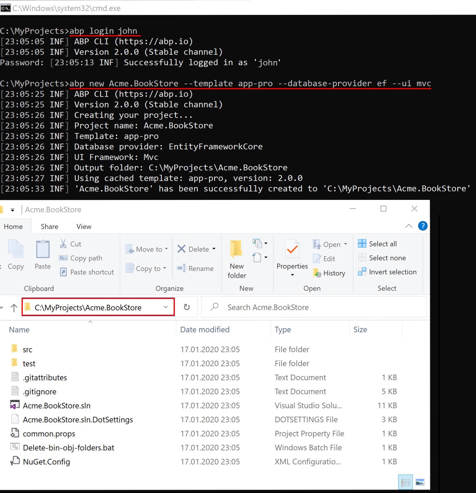
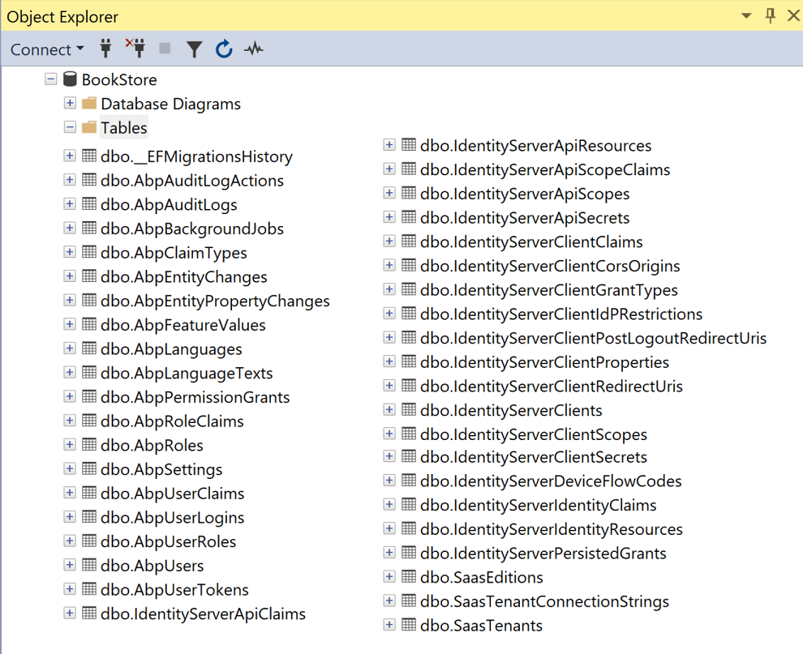
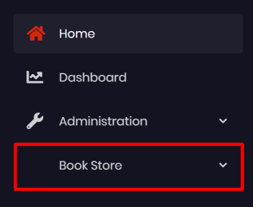
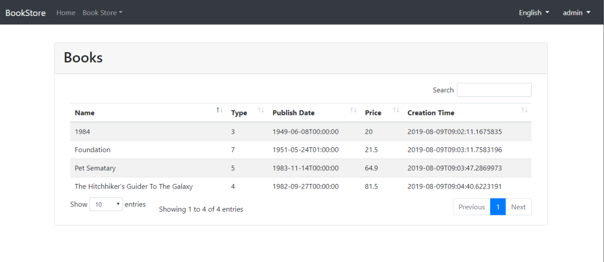

## ASP.NET Core {{UI_Value}} Tutorial - Part 1
````json
//[doc-params]
{
    "UI": ["MVC","NG"]
}
````

### About this tutorial

In this tutorial series, you will build an ABP Commercial application named `Acme.BookStore`. In this sample project we will manage a list of books and authors. **Entity Framework Core** (`EF Core`), the default database provider, will be used as the ORM provider. {{UI_Value}} and JavaScript will be used on the front-end. 

The ASP.NET Core {{UI_Value}} tutorial series consists of 3 parts:

- **Part-1: Creating the project and book list page (this tutorial)** 
- [Part-2: Creating, updating and deleting books](part-2.md)
- [Part-3: Integration tests](part-3.md)

You can access to the final **source-code** of this application from the following link [GitHub: BookStore](https://github.com/abpframework/abp/tree/master/samples/BookStore). You can also check out [the video course](https://amazingsolutions.teachable.com/p/lets-build-the-bookstore-application) prepared by the community, based on this tutorial.

### Creating the project

Create a new project named `Acme.BookStore` where `Acme` is the company name and `BookStore` is the project name. You can check out [creating a new project](../../getting-started#create-a-new-project) document to see how you can create a new project.  We will create the project with ABP CLI. But first of all, we need to login to the ABP Platform to create a commercial project.

#### Login to the ABP Platform

Run the below command to login with your username, then enter your password when it asks.

```bash
abp login <username>
```

> If you get the below error message, it means you are not logged in with a commercial account. You can contact to info@abp.io for the license issues.
>
> *Remote server returns '403-Forbidden'. Message: Pro templates require a commercial license! Should login to be able to download a pro template.*

#### Create the project

By running the below command, it creates a new ABP Commercial project with the database provider `Entity Framework Core` and UI option `MVC`. To see the other CLI options, check out [ABP CLI](https://docs.abp.io/en/abp/latest/CLI) document.

```bash
abp new Acme.BookStore --template app-pro --database-provider ef --ui mvc
```



### Apply migrations

After creating the project, you need to apply the initial migrations and create the database. To apply migrations, right click on the `Acme.BookStore.DbMigrator` and click **Debug** > **Start New Instance**. This will run the application and apply all migrations. You will see the below result when it successfully completes the process. The application database is  ready!


> Alternatively, you can run `Update-Database` command in the Visual Studio > Package Manager Console to apply migrations.



### Run the application

To run the project, right click to the `Acme.BookStore.Web` project and click **Set As StartUp Project**. And run the web project by pressing **CTRL+F5** (*without debugging and fast*) or press **F5** (*with debugging and slow*).

Further information, see the [running the application section](../../getting-started.md#run-the-application).


The default login credentials are;

* **Username**: admin
* **Password**: 1q2w3E*

### Solution structure

This is how the layered solution structure looks like:


Check out the [solution structure](../../startup-templates/application/solution-structure.md) document to understand the solution structure in details. 

### Create the book entity

Domain layer in the startup template is separated into two projects:

- `Acme.BookStore.Domain` contains your [entities](https://docs.abp.io/en/abp/latest/Entities), [domain services](https://docs.abp.io/en/abp/latest/Domain-Services) and other core domain objects.
- `Acme.BookStore.Domain.Shared` contains `constants`, `enums` or other domain related objects those can be shared with clients.

Define [entities](https://docs.abp.io/en/abp/latest/Entities) in the **domain layer** (`Acme.BookStore.Domain` project) of the solution. The main entity of the application is the `Book`. Create a class, named `Book`, in the `Acme.BookStore.Domain` project as shown below:

````csharp
using System;
using Volo.Abp.Domain.Entities.Auditing;

namespace Acme.BookStore
{
    public class Book : AuditedAggregateRoot<Guid>
    {
        public string Name { get; set; }

        public BookType Type { get; set; }

        public DateTime PublishDate { get; set; }

        public float Price { get; set; }

        protected Book()
        {

        }

        public Book(Guid id, string name, BookType type, DateTime publishDate, float price) :
            base(id)
        {
            Name = name;
            Type = type;
            PublishDate = publishDate;
            Price = price;
        }
    }
}
````

* ABP has 2 fundamental base classes for entities: `AggregateRoot` and `Entity`. **Aggregate Root** is one of the **Domain Driven Design (DDD)** concepts. See [entity document](https://docs.abp.io/en/abp/latest/Entities) for details and best practices.
* `Book` entity inherits `AuditedAggregateRoot` which adds some auditing properties (`CreationTime`, `CreatorId`, `LastModificationTime`... etc.) on top of the `AggregateRoot` class.
* `Guid` is the **primary key type** of the `Book` entity.

#### BookType enum

Create the `BookType` enum in the `Acme.BookStore.Domain.Shared` project:

````csharp
namespace Acme.BookStore
{
    public enum BookType
    {
        Undefined,
        Adventure,
        Biography,
        Dystopia,
        Fantastic,
        Horror,
        Science,
        ScienceFiction,
        Poetry
    }
}
````

#### Add book entity to the DbContext

EF Core requires to relate entities with your `DbContext`. The easiest way to do this is to add a `DbSet` property to the `BookStoreDbContext` class in the `Acme.BookStore.EntityFrameworkCore` project, as shown below:

````csharp
    public class BookStoreDbContext : AbpDbContext<BookStoreDbContext>
    {
        public DbSet<AppUser> Users { get; set; }
        public DbSet<Book> Books { get; set; } //<--added this line-->
		//...
    }
````

#### Configure the book entity

Open `BookStoreDbContextModelCreatingExtensions.cs` file in the `Acme.BookStore.EntityFrameworkCore` project and add following code to the end of the `ConfigureBookStore` method to configure the Book entity:

````csharp
builder.Entity<Book>(b =>
{
    b.ToTable(BookStoreConsts.DbTablePrefix + "Books", BookStoreConsts.DbSchema);
    b.ConfigureByConvention(); //auto configure for the base class props
    b.Property(x => x.Name).IsRequired().HasMaxLength(128);
});
````

Add the `using Volo.Abp.EntityFrameworkCore.Modeling;` statement to resolve `ConfigureByConvention` extension method.

#### Add new migration & update the database

The startup template uses [EF Core Code First Migrations](https://docs.microsoft.com/en-us/ef/core/managing-schemas/migrations/) to create and maintain the database schema. Open the **Package Manager Console (PMC)** under the menu *Tools > NuGet Package Manager*.


Select the `Acme.BookStore.EntityFrameworkCore.DbMigrations` as the **default project** and execute the following command:

```bash
Add-Migration "Created_Book_Entity"
```


This will create a new migration class inside the `Migrations` folder of the `Acme.BookStore.EntityFrameworkCore.DbMigrations` project. Then execute the `Update-Database` command to update the database schema:

````bash
Update-Database
````


#### Add some sample data

`Update-Database` command has created the `AppBooks` table in the database. Open your database and enter a few sample rows, so you can show them on the listing page.

```mssql
INSERT INTO AppBooks (Id,CreationTime,[Name],[Type],PublishDate,Price) VALUES
('f3c04764-6bfd-49e2-859e-3f9bfda6183e', '2018-07-01', '1984',3,'1949-06-08','19.84')

INSERT INTO AppBooks (Id,CreationTime,[Name],[Type],PublishDate,Price) VALUES
('13024066-35c9-473c-997b-83cd8d3e29dc', '2018-07-01', 'The Hitchhiker`s Guide to the Galaxy',7,'1995-09-27','42')

INSERT INTO AppBooks (Id,CreationTime,[Name],[Type],PublishDate,Price) VALUES
('4fa024a1-95ac-49c6-a709-6af9e4d54b54', '2018-07-02', 'Pet Sematary',5,'1983-11-14','23.7')
```


### Create the application service

The next step is to create an [application service](../../Application-Services.md) to manage the books which will allow us the four basic functions: creating, reading, updating and deleting. Application layer is separated into two projects:

* `Acme.BookStore.Application.Contracts` mainly contains your `DTO`s and application service interfaces.
* `Acme.BookStore.Application` contains the implementations of your application services.

#### BookDto

Create a DTO class named `BookDto` into the `Acme.BookStore.Application.Contracts` project:

````csharp
using System;
using Volo.Abp.Application.Dtos;

namespace Acme.BookStore
{
    public class BookDto : AuditedEntityDto<Guid>
    {
        public string Name { get; set; }

        public BookType Type { get; set; }

        public DateTime PublishDate { get; set; }

        public float Price { get; set; }
    }
}
````

* **DTO** classes are used to **transfer data** between the *presentation layer* and the *application layer*. See the [Data Transfer Objects document](https://docs.abp.io/en/abp/latest/Data-Transfer-Objects) for more details.
* `BookDto` is used to transfer book data to the presentation layer in order to show the book information on the UI.
* `BookDto` is derived from the `AuditedEntityDto<Guid>` which has audit properties just like the `Book` class defined above.

It will be needed to map `Book` entities to `BookDto` objects while returning books to the presentation layer. [AutoMapper](https://automapper.org) library can automate this conversion when you define the proper mapping. The startup template comes with AutoMapper configured, so you can just define the mapping in the `BookStoreApplicationAutoMapperProfile` class in the `Acme.BookStore.Application` project:

````csharp
using AutoMapper;

namespace Acme.BookStore
{
    public class BookStoreApplicationAutoMapperProfile : Profile
    {
        public BookStoreApplicationAutoMapperProfile()
        {
            CreateMap<Book, BookDto>();
        }
    }
}
````

#### CreateUpdateBookDto

Create a DTO class named `CreateUpdateBookDto` into the `Acme.BookStore.Application.Contracts` project:

````csharp
using System;
using System.ComponentModel.DataAnnotations;

namespace Acme.BookStore
{
    public class CreateUpdateBookDto
    {
        [Required]
        [StringLength(128)]
        public string Name { get; set; }

        [Required]
        public BookType Type { get; set; } = BookType.Undefined;

        [Required]
        public DateTime PublishDate { get; set; }

        [Required]
        public float Price { get; set; }
    }
}
````

* This `DTO` class is used to get book information from the user interface while creating or updating a book.
* It defines data annotation attributes (like `[Required]`) to define validations for the properties. `DTO`s are [automatically validated](https://docs.abp.io/en/abp/latest/Validation) by the ABP framework.

Next, add a mapping in `BookStoreApplicationAutoMapperProfile` from the `CreateUpdateBookDto` object to the `Book` entity with the `CreateMap<CreateUpdateBookDto, Book>();` command:

````csharp
using AutoMapper;

namespace Acme.BookStore
{
    public class BookStoreApplicationAutoMapperProfile : Profile
    {
        public BookStoreApplicationAutoMapperProfile()
        {
            CreateMap<Book, BookDto>();
            CreateMap<CreateUpdateBookDto, Book>(); //<--added this line-->
        }
    }
}
````

#### IBookAppService

Create an interface named `IBookAppService` in the `Acme.BookStore.Application.Contracts` project:

````csharp
using System;
using Volo.Abp.Application.Dtos;
using Volo.Abp.Application.Services;

namespace Acme.BookStore
{
    public interface IBookAppService : 
        ICrudAppService< //Defines CRUD methods
            BookDto, //Used to show books
            Guid, //Primary key of the book entity
            PagedAndSortedResultRequestDto, //Used for paging/sorting on getting a list of books
            CreateUpdateBookDto, //Used to create a new book
            CreateUpdateBookDto> //Used to update a book
    {

    }
}
````

* Defining interfaces for the application services **are not required** by the framework. However, it's suggested as a best practice.
* `ICrudAppService` defines common **CRUD** methods: `GetAsync`, `GetListAsync`, `CreateAsync`, `UpdateAsync` and `DeleteAsync`. It's not required to extend it. Instead, you could inherit from the empty `IApplicationService` interface and define your own methods manually.
* There are some variations of the `ICrudAppService` where you can use separated DTOs for each method.

#### BookAppService

Implement the `IBookAppService` as named `BookAppService` in the `Acme.BookStore.Application` project:

````csharp
using System;
using Volo.Abp.Application.Dtos;
using Volo.Abp.Application.Services;
using Volo.Abp.Domain.Repositories;

namespace Acme.BookStore
{
    public class BookAppService : 
        CrudAppService<Book, BookDto, Guid, PagedAndSortedResultRequestDto,
                       CreateUpdateBookDto, CreateUpdateBookDto>,
        IBookAppService
    {
        public BookAppService(IRepository<Book, Guid> repository) 
            : base(repository)
        {

        }
    }
}
````

* `BookAppService` is derived from `CrudAppService<...>` which implements all the CRUD (create, read, update, delete) methods defined above.
* `BookAppService` injects `IRepository<Book, Guid>` which is the default repository for the `Book` entity. ABP automatically creates default repositories for each aggregate root (or entity). See the [repository document](https://docs.abp.io/en/abp/latest/Repositories).
* `BookAppService` uses `IObjectMapper` to map `Book` objects to `BookDto` objects and `CreateUpdateBookDto` objects to `Book` objects. The Startup template uses the [AutoMapper](http://automapper.org/) library as the object mapping provider. We have defined the mappings before, so it will work as expected.

### Dynamic JavaScript proxiesAuto API Controllers

We normally create **Controllers** to expose application services as **HTTP API** endpoints. That allows browser or 3rd-party clients to call them via AJAX. ABP can [**automagically**](https://docs.abp.io/en/abp/latest/AspNetCore/Auto-API-Controllers) configures your application services as MVC API Controllers by convention.

#### Swagger UI

The startup template is configured to run the [Swagger UI](https://swagger.io/tools/swagger-ui/) using the [Swashbuckle.AspNetCore](https://github.com/domaindrivendev/Swashbuckle.AspNetCore) library. Run the application by pressing `CTRL+F5` and navigate to `https://localhost:XXXX/swagger/` on your browser. (Replace `XXXX` by your own port.)

You will see some built-in service endpoints as well as the `Book` service and its REST-style endpoints:


Swagger has a nice interface to test the APIs. You can try to execute the `[GET] /api/app/book` API to get a list of books.

### Dynamic JavaScript proxies

It's common to call HTTP API endpoints via AJAX from the **JavaScript** side. You can use `$.ajax` or another tool to call the endpoints. However, ABP offers a better way.

ABP **dynamically** creates JavaScript **proxies** for all API endpoints. So, you can use any **endpoint** just like calling a **JavaScript function**.

#### Testing in developer console of the browser

You can easily test the JavaScript proxies using your favorite browser's **Developer Console**. Run the application, open your browser's **developer tools** (*shortcut is F12 for Chrome*), switch to the **Console** tab, type the following code and press enter:

````js
acme.bookStore.book.getList({}).done(function (result) { console.log(result); });
````

* `acme.bookStore` is the namespace of the `BookAppService` converted to [camelCase](https://en.wikipedia.org/wiki/Camel_case).
* `book` is the conventional name for the `BookAppService` (removed `AppService` postfix and converted to camelCase).
* `getList` is the conventional name for the `GetListAsync` method defined in the `AsyncCrudAppService` base class (removed `Async` postfix and converted to camelCase).
* `{}` argument is used to send an empty object to the `GetListAsync` method which normally expects an object of type `PagedAndSortedResultRequestDto` that is used to send paging and sorting options to the server (all properties are optional, so you can send an empty object).
* `getList` function returns a `promise`. You can pass a callback to the `done` (or `then`) function to get the result from the server.

Running this code produces the following output:


You can see the **book list** returned from the server. You can also check the **network** tab of the developer tools to see the client to server communication:


Let's **create a new book** using the `create` function:

````js
acme.bookStore.book.create({ name: 'Foundation', type: 7, publishDate: '1951-05-24', price: 21.5 }).done(function (result) { console.log('successfully created the book with id: ' + result.id); });
````

You should see a message in the console something like that:

````js
successfully created the book with id: 439b0ea8-923e-8e1e-5d97-39f2c7ac4246
````

Check the `Books` table in the database to see the new book row. You can try `get`, `update` and `delete` functions yourself.

### Create the books page

It's time to create something visible and usable! Instead of classic MVC, we will use the new [Razor Pages UI](https://docs.microsoft.com/en-us/aspnet/core/tutorials/razor-pages/razor-pages-start) approach which is recommended by Microsoft.

Create `Books` folder under the `Pages` folder of the `Acme.BookStore.Web` project. Add a new Razor Page by right clicking the Books folder then selecting **Add > Razor Page** menu item. Name it as `Index`:


Open the `Index.cshtml` and change the whole content as shown below:

**Index.cshtml:**

````html
@page
@using Acme.BookStore.Web.Pages.Books
@inherits Acme.BookStore.Web.Pages.BookStorePage
@model IndexModel

<h2>Books</h2>
````

* This code changes the default inheritance of the Razor View Page Model so it **inherits** from the `BookStorePage` class (instead of `PageModel`).  The `BookStorePage` class which comes with the startup template, provides some shared properties/methods used by all pages.

* Set the `IndexModel`'s namespace to `Acme.BookStore.Pages.Books`  in `Index.cshtml.cs`.

  

**Index.cshtml.cs:**

```csharp
using Microsoft.AspNetCore.Mvc.RazorPages;

namespace Acme.BookStore.Web.Pages.Books
{
    public class IndexModel : PageModel
    {
        public void OnGet()
        {

        }
    }
}
```


#### Add books page to the main menu

Open the `BookStoreMenuContributor` class in the `Menus` folder and add the following code to the end of the `ConfigureMainMenuAsync` method:

````csharp
//...
namespace Acme.BookStore.Web.Menus
{
    public class BookStoreMenuContributor : IMenuContributor
    { 
        private async Task ConfigureMainMenuAsync(MenuConfigurationContext context)
        {
            //<-- added the below code
            context.Menu.AddItem(
                new ApplicationMenuItem("BooksStore", l["Menu:BookStore"])
                    .AddItem(
                        new ApplicationMenuItem("BooksStore.Books", l["Menu:Books"], url: "/Books")
                    )
            );
            //-->
        }
    }
}
````

#### Localize the menu items

Localization texts are located under the `Localization/BookStore` folder of the `Acme.BookStore.Domain.Shared` project:


Open the `en.json` (*English translations*) file and add the below localization texts for `Menu:BookStore` and `Menu:Books` keys to the end of the file:

````json
{
  "culture": "en",
  "texts": {
    //...  
    "Menu:BookStore": "Book Store",
    "Menu:Books": "Books"
  }
}
````

* ABP's localization system is built on [ASP.NET Core's standard localization](https://docs.microsoft.com/en-us/aspnet/core/fundamentals/localization) system and extends it in many ways. See the [localization document](https://docs.abp.io/en/abp/latest/Localization) for details.
* Localization key names are arbitrary. You can set any name. As a best practice, we prefer to add `Menu:` prefix for menu items to distinguish from other texts. If a text is not defined in the localization file, it **fallbacks** to the localization key (as ASP.NET Core's standard behavior).

Run the project, login to the application with the username `admin` and password `1q2w3E*` and see the new menu item has been added to the menu.



When you click to the Books menu item under the Book Store parent, you are being redirected to the new Books page.

#### Book list

We will use the [Datatables.net](https://datatables.net/) jQuery plugin to show the book list. Datatables can completely work via AJAX, it is fast, popular and provides a good user experience. Datatables plugin is configured in the startup template, so you can directly use it in any page without including any style or script file to your page.

##### Index.cshtml

Change the `Pages/Books/Index.cshtml` as following:

````html
@page
@inherits Acme.BookStore.Web.Pages.BookStorePage
@model Acme.BookStore.Web.Pages.Books.IndexModel
@section scripts
{
    <abp-script src="/Pages/Books/index.js" />
}
<abp-card>
    <abp-card-header>
        <h2>@L["Books"]</h2>
    </abp-card-header>
    <abp-card-body>
        <abp-table striped-rows="true" id="BooksTable">
            <thead>
                <tr>
                    <th>@L["Name"]</th>
                    <th>@L["Type"]</th>
                    <th>@L["PublishDate"]</th>
                    <th>@L["Price"]</th>
                    <th>@L["CreationTime"]</th>
                </tr>
            </thead>
        </abp-table>
    </abp-card-body>
</abp-card>
````

* `abp-script` [tag helper](https://docs.microsoft.com/en-us/aspnet/core/mvc/views/tag-helpers/intro) is used to add external **scripts** to the page. It has many additional features compared to standard `script` tag. It handles **minification** and **versioning**. See the [bundling & minification document](https://docs.abp.io/en/abp/latest/AspNetCore/Bundling-Minification) for details.
* `abp-card` and `abp-table` are **tag helpers** for Twitter Bootstrap's [card component](http://getbootstrap.com/docs/4.1/components/card/). There are other useful tag helpers in ABP to easily use most of the [bootstrap](https://getbootstrap.com/) components. You can also use regular HTML tags instead of these tag helpers, but using tag helpers reduces HTML code and prevents errors by help the of IntelliSense and compile time type checking. Further information, see the [tag helpers](https://docs.abp.io/en/abp/latest/AspNetCore/Tag-Helpers/Index) document.
* You can **localize** the column names in the localization file as you did for the menu items above.

##### Add a Script File

Create `index.js` JavaScript file under the `Pages/Books/` folder:


`index.js` content is shown below:

````js
$(function () {
    var dataTable = $('#BooksTable').DataTable(abp.libs.datatables.normalizeConfiguration({
        ajax: abp.libs.datatables.createAjax(acme.bookStore.book.getList),
        columnDefs: [
            { data: "name" },
            { data: "type" },
            { data: "publishDate" },
            { data: "price" },
            { data: "creationTime" }
        ]
    }));
});
````

* `abp.libs.datatables.createAjax` is a helper function to adapt ABP's dynamic JavaScript API proxies to Datatable's format.
* `abp.libs.datatables.normalizeConfiguration` is another helper function. There's no requirement to use it, but it simplifies the Datatables configuration by providing conventional values for missing options.
* `acme.bookStore.book.getList` is the function to get list of books (as described in [dynamic JavaScript proxies](#Dynamic JavaScript proxies)).
* See [Datatable's documentation](https://datatables.net/manual/) for all configuration options.

It's end of this part. The final UI of this work is shown as below:



### Next Part

See the [part 2](part-2.md) for creating, updating and deleting books.
