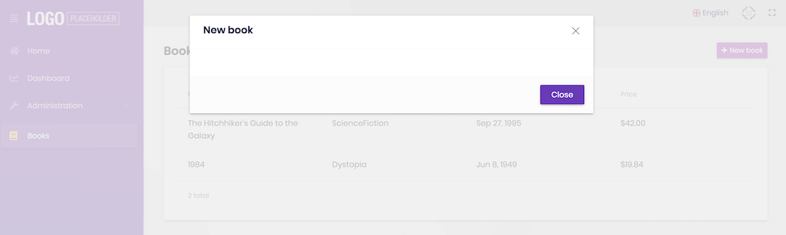
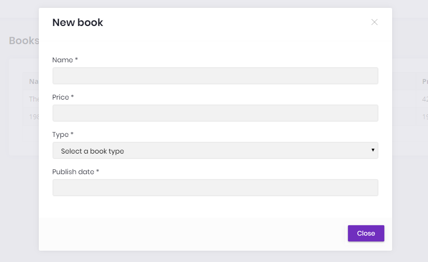
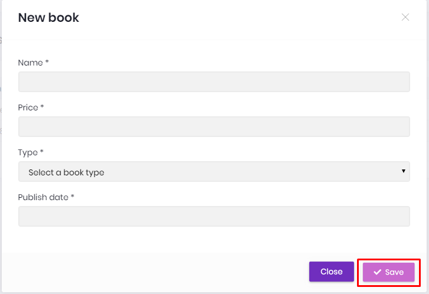
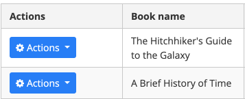
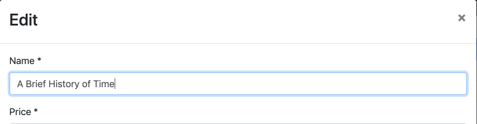
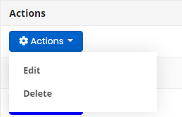
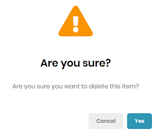

## ASP.NET Core {{UI_Value}} Tutorial - Part 2
````json
//[doc-params]
{
    "UI": ["MVC","NG"]
}
````

{{
if UI == "MVC"
  DB="ef"
  DB_Text="Entity Framework Core"
  UI_Text="mvc"
else if UI == "NG"
  DB="mongodb"
  DB_Text="MongoDB"
  UI_Text="angular"
else 
  DB ="?"
  UI_Text="?"
end
}}

### About this tutorial

This is the second part of the ASP.NET Core {{UI_Value}} tutorial series. All parts:

* [Part I: Creating the project and book list page](part-1.md)
* **Part II: Creating, updating and deleting books (this tutorial)**
* [Part III: Integration tests](part-3.md)

*You can also watch [this video course](https://amazingsolutions.teachable.com/p/lets-build-the-bookstore-application) prepared by an ABP community member, based on this tutorial.*

{{if UI == "MVC"}}

### Creating a new book

In this section, you will learn how to create a new modal dialog form to create a new book. The modal dialog will look like in the below image:


#### Create the modal form

Create a new razor page, named `CreateModal.cshtml` under the `Pages/Books` folder of the `Acme.BookStore.Web` project.


##### CreateModal.cshtml.cs

Open the `CreateModal.cshtml.cs` file (`CreateModalModel` class) and replace with the following code:

````C#
using System.Threading.Tasks;
using Microsoft.AspNetCore.Mvc;

namespace Acme.BookStore.Web.Pages.Books
{
    public class CreateModalModel : BookStorePageModel
    {
        [BindProperty]
        public CreateUpdateBookDto Book { get; set; }

        private readonly IBookAppService _bookAppService;

        public CreateModalModel(IBookAppService bookAppService)
        {
            _bookAppService = bookAppService;
        }

        public async Task<IActionResult> OnPostAsync()
        {
            await _bookAppService.CreateAsync(Book);
            return NoContent();
        }
    }
}
````

* This class is derived from the `BookStorePageModel` instead of standard `PageModel`. `BookStorePageModel` inherits the `PageModel` and adds some common properties & methods that can be used in your page model classes.
* `[BindProperty]` attribute on the `Book` property binds post request data to this property.
* This class simply injects the `IBookAppService` in the constructor and calls the `CreateAsync` method in the `OnPostAsync` handler.

##### CreateModal.cshtml

Open the `CreateModal.cshtml` file and paste the code below:

````html
@page
@inherits Acme.BookStore.Web.Pages.BookStorePage
@using Volo.Abp.AspNetCore.Mvc.UI.Bootstrap.TagHelpers.Modal
@model Acme.BookStore.Web.Pages.Books.CreateModalModel
@{
    Layout = null;
}
<abp-dynamic-form abp-model="Book" data-ajaxForm="true" asp-page="/Books/CreateModal">
    <abp-modal>
        <abp-modal-header title="@L["NewBook"].Value"></abp-modal-header>
        <abp-modal-body>
            <abp-form-content />
        </abp-modal-body>
        <abp-modal-footer buttons="@(AbpModalButtons.Cancel|AbpModalButtons.Save)"></abp-modal-footer>
    </abp-modal>
</abp-dynamic-form>
````

* This modal uses `abp-dynamic-form` tag helper to automatically create the form from the model  `CreateBookViewModel`.
  * `abp-model` attribute indicates the model object where it's the `Book` property in this case.
  * `data-ajaxForm` attribute sets the form to submit via AJAX, instead of a classic page post.
  * `abp-form-content` tag helper is a placeholder to render the form controls (it is optional and needed only if you have added some other content in the `abp-dynamic-form` tag, just like in this page).

#### Add the "New book" button

Open the `Pages/Books/Index.cshtml` and set the content of `abp-card-header` tag as below:

````html
<abp-card-header>
    <abp-row>
        <abp-column size-md="_6">
            <h2>@L["Books"]</h2>
        </abp-column>
        <abp-column size-md="_6" class="text-right">
            <abp-button id="NewBookButton"
                        text="@L["NewBook"].Value"
                        icon="plus"
                        button-type="Primary" />
        </abp-column>
    </abp-row>
</abp-card-header>
````

This adds a new button called **New book** to the **top-right** of the table:


Open the `pages/books/index.js` and add the following code just after the `Datatable` configuration:

````js
var createModal = new abp.ModalManager(abp.appPath + 'Books/CreateModal');

createModal.onResult(function () {
    dataTable.ajax.reload();
});

$('#NewBookButton').click(function (e) {
    e.preventDefault();
    createModal.open();
});
````

* `abp.ModalManager` is a helper class to manage modals in the client side. It internally uses Twitter Bootstrap's standard modal, but abstracts many details by providing a simple API.

Now, you can **run the application** and add new books using the new modal form.

### Updating a book

Create a new razor page, named `EditModal.cshtml` under the `Pages/Books` folder of the `Acme.BookStore.Web` project:


#### EditModal.cshtml.cs

Open the `EditModal.cshtml.cs` file (`EditModalModel` class) and replace with the following code:

````csharp
using System;
using System.Threading.Tasks;
using Microsoft.AspNetCore.Mvc;

namespace Acme.BookStore.Web.Pages.Books
{
    public class EditModalModel : BookStorePageModel
    {
        [HiddenInput]
        [BindProperty(SupportsGet = true)]
        public Guid Id { get; set; }

        [BindProperty]
        public CreateUpdateBookDto Book { get; set; }

        private readonly IBookAppService _bookAppService;

        public EditModalModel(IBookAppService bookAppService)
        {
            _bookAppService = bookAppService;
        }

        public async Task OnGetAsync()
        {
            var bookDto = await _bookAppService.GetAsync(Id);
            Book = ObjectMapper.Map<BookDto, CreateUpdateBookDto>(bookDto);
        }

        public async Task<IActionResult> OnPostAsync()
        {
            await _bookAppService.UpdateAsync(Id, Book);
            return NoContent();
        }
    }
}
````

* `[HiddenInput]` and `[BindProperty]` are standard ASP.NET Core MVC attributes. `SupportsGet` is used to be able to get `Id` value from query string parameter of the request.
* In the `GetAsync` method, we get `BookDto `from `BookAppService` and this is being mapped to the DTO object `CreateUpdateBookDto`.
* The `OnPostAsync` uses `BookAppService.UpdateAsync()` to update the entity.

#### Mapping from BookDto to CreateUpdateBookDto 

To be able to map the `BookDto` to `CreateUpdateBookDto`, configure a new mapping. To do this, open the `BookStoreWebAutoMapperProfile.cs` in the `Acme.BookStore.Web` project and change it as shown below:

````csharp
using AutoMapper;

namespace Acme.BookStore.Web
{
    public class BookStoreWebAutoMapperProfile : Profile
    {
        public BookStoreWebAutoMapperProfile()
        {
            CreateMap<BookDto, CreateUpdateBookDto>();
        }
    }
}
````

* We have just added `CreateMap<BookDto, CreateUpdateBookDto>();` to define this mapping.

#### EditModal.cshtml

Replace `EditModal.cshtml` content with the following content:

````html
@page
@inherits Acme.BookStore.Web.Pages.BookStorePage
@using Acme.BookStore.Web.Pages.Books
@using Volo.Abp.AspNetCore.Mvc.UI.Bootstrap.TagHelpers.Modal
@model EditModalModel
@{
    Layout = null;
}
<abp-dynamic-form abp-model="Book" data-ajaxForm="true" asp-page="/Books/EditModal">
    <abp-modal>
        <abp-modal-header title="@L["Update"].Value"></abp-modal-header>
        <abp-modal-body>
            <abp-input asp-for="Id" />
            <abp-form-content />
        </abp-modal-body>
        <abp-modal-footer buttons="@(AbpModalButtons.Cancel|AbpModalButtons.Save)"></abp-modal-footer>
    </abp-modal>
</abp-dynamic-form>
````

This page is very similar to the `CreateModal.cshtml`, except:

* It includes an `abp-input` for the `Id` property to store `Id` of the editing book (which is a hidden input).
* It uses `Books/EditModal` as the post URL and *Update* text as the modal header.

#### Add "Actions" dropdown to the table

We will add a dropdown button to the table named *Actions*. 

Open the `Pages/Books/Index.cshtml` page and change the `<abp-table>` section as shown below:

````html
<abp-table striped-rows="true" id="BooksTable">
    <thead>
        <tr>
            <th>@L["Actions"]</th>
            <th>@L["Name"]</th>
            <th>@L["Type"]</th>
            <th>@L["PublishDate"]</th>
            <th>@L["Price"]</th>
            <th>@L["CreationTime"]</th>
        </tr>
    </thead>
</abp-table>
````

* We just added a new `th` tag for the "*Actions*" button.

Open the `pages/books/index.js` and replace the content as below:

````js
$(function () {

    var l = abp.localization.getResource('BookStore');

    var createModal = new abp.ModalManager(abp.appPath + 'Books/CreateModal');
    var editModal = new abp.ModalManager(abp.appPath + 'Books/EditModal');

    var dataTable = $('#BooksTable').DataTable(abp.libs.datatables.normalizeConfiguration({
        processing: true,
        serverSide: true,
        paging: true,
        searching: false,
        autoWidth: false,
        scrollCollapse: true,
        order: [[1, "asc"]],
        ajax: abp.libs.datatables.createAjax(acme.bookStore.book.getList),
        columnDefs: [
            {
                rowAction: {
                    items:
                        [
                            {
                                text: l('Edit'),
                                action: function (data) {
                                    editModal.open({ id: data.record.id });
                                }
                            }
                        ]
                }
            },
            { data: "name" },
            { data: "type" },
            { data: "publishDate" },
            { data: "price" },
            { data: "creationTime" }
        ]
    }));

    createModal.onResult(function () {
        dataTable.ajax.reload();
    });

    editModal.onResult(function () {
        dataTable.ajax.reload();
    });

    $('#NewBookButton').click(function (e) {
        e.preventDefault();
        createModal.open();
    });
});
````

* Used `abp.localization.getResource('BookStore')` to be able to use the same localization texts defined on the server-side.
* Added a new `ModalManager` named `createModal` to open the create modal dialog.
* Added a new `ModalManager` named `editModal` to open the edit modal dialog.
* Added a new column at the beginning of the `columnDefs` section. This column is used for the "*Actions*" dropdown button.
* "*New Book*" action simply calls `createModal.open()` to open the create dialog.
* "*Edit*" action simply calls `editModal.open()` to open the edit dialog.

You can run the application and edit any book by selecting the edit action. The final UI looks as below:


### Deleting a book

Open the `pages/books/index.js` and add a new item to the `rowAction` `items`:

````js
{
    text: l('Delete'),
    confirmMessage: function (data) {
        return l('BookDeletionConfirmationMessage', data.record.name);
    },
    action: function (data) {
        acme.bookStore.book
            .delete(data.record.id)
            .then(function() {
                abp.notify.info(l('SuccessfullyDeleted'));
                dataTable.ajax.reload();
            });
    }
}
````

* `confirmMessage` option is used to ask a confirmation question before executing the `action`.
* `acme.bookStore.book.delete()` method makes an AJAX request to JavaScript proxy function to delete a book.
* `abp.notify.info()` shows a notification after the delete operation.

The final `index.js` content is shown below:

````js
$(function () {

    var l = abp.localization.getResource('BookStore');

    var createModal = new abp.ModalManager(abp.appPath + 'Books/CreateModal');
    var editModal = new abp.ModalManager(abp.appPath + 'Books/EditModal');

    var dataTable = $('#BooksTable').DataTable(abp.libs.datatables.normalizeConfiguration({
        processing: true,
        serverSide: true,
        paging: true,
        searching: false,
        autoWidth: false,
        scrollCollapse: true,
        order: [[1, "asc"]],
        ajax: abp.libs.datatables.createAjax(acme.bookStore.book.getList),
        columnDefs: [
            {
                rowAction: {
                    items:
                    [
                        {
                            text: l('Edit'),
                            action: function (data) {
                                editModal.open({ id: data.record.id });
                            }
                        },
                        {
                            text: l('Delete'),
                            confirmMessage: function (data) {
                                return l('BookDeletionConfirmationMessage', data.record.name);
                            },
                            action: function (data) {
                                acme.bookStore.book
                                    .delete(data.record.id)
                                    .then(function() {
                                        abp.notify.info(l('SuccessfullyDeleted'));
                                        dataTable.ajax.reload();
                                    });
                            }
                        }
                    ]
                }
            },
            { data: "name" },
            { data: "type" },
            { data: "publishDate" },
            { data: "price" },
            { data: "creationTime" }
        ]
    }));

    createModal.onResult(function () {
        dataTable.ajax.reload();
    });

    editModal.onResult(function () {
        dataTable.ajax.reload();
    });

    $('#NewBookButton').click(function (e) {
        e.preventDefault();
        createModal.open();
    });
});
````

Open the `en.json` in the `Acme.BookStore.Domain.Shared` project and add the following translations:

````json
"BookDeletionConfirmationMessage": "Are you sure to delete the book {0}?",
"SuccessfullyDeleted": "Successfully deleted"
````

Run the application and try to delete a book.

{{end}}

{{if UI == "NG"}}

### Creating a new book

In this section, you will learn how to create a new modal dialog form to create a new book.

#### Type definition

Create an interface, named `CreateUpdateBookInput` in the `books.ts` as shown below:

```js
export namespace Books {
  //...
  export interface CreateUpdateBookInput {
    name: string;
    type: BookType;
    publishDate: string;
    price: number;
  }
}
```

`CreateUpdateBookInput` interface matches the `CreateUpdateBookDto` in the backend.

#### Service method

Open the `books.service.ts` and add a new method, named `create` to perform an HTTP POST request to the server:

```js
create(createBookInput: Books.CreateUpdateBookInput): Observable<Books.Book> {
  return this.restService.request<Books.CreateUpdateBookInput, Books.Book>({
    method: 'POST',
    url: '/api/app/book',
    body: createBookInput
  });
}
```

- `restService.request` function gets generic parameters for the types sent to and received from the server. This example sends a `CreateUpdateBookInput` object and receives a `Book` object (you can set `void` for request or return type if not used).

#### State definitions

Add the `CreateUpdateBook` action to the `books.actions.ts` as shown below:

```js
import { Books } from '../models';

export class CreateUpdateBook {
  static readonly type = '[Books] Create Update Book';
  constructor(public payload: Books.CreateUpdateBookInput) {}
}
```

Open `books.state.ts` and define the `save` method that will listen to a `CreateUpdateBook` action to create a book:

```js
import { ... , CreateUpdateBook } from '../actions/books.actions';
import { ... , switchMap } from 'rxjs/operators';
//...
@Action(CreateUpdateBook)
save(ctx: StateContext<Books.State>, action: CreateUpdateBook) {
  return this.booksService
      .create(action.payload)
      .pipe(switchMap(() => ctx.dispatch(new GetBooks())));
}
```

When the `SaveBook` action dispatched, the save method is executed. It call `create` method of the `BooksService` defined before. After the service call, `BooksState` dispatches the `GetBooks` action to get books again from the server to refresh the page.

#### Add a modal to BookListComponent

Open the `book-list.component.html` and add the `abp-modal` to show/hide the modal to create a new book.

```html
<abp-modal [(visible)]="isModalOpen">
  <ng-template #abpHeader>
    <h3>New Book</h3>
  </ng-template>

  <ng-template #abpBody> </ng-template>

  <ng-template #abpFooter>
    <button type="button" class="btn btn-secondary" #abpClose>
      Cancel
    </button>
  </ng-template>
</abp-modal>
```

`abp-modal` is a pre-built component to show modals. While you could use another approach to show a modal, `abp-modal` provides additional benefits.

Add a button, labeled `New book` to show the modal:

```html
<div class="row">
  <div class="col col-md-6">
    <h5 class="card-title">
      Books
    </h5>
  </div>
  <div class="text-right col col-md-6">
    <button id="create-role" class="btn btn-primary" type="button" (click)="createBook()">
      <i class="fa fa-plus mr-1"></i> <span>New book</span>
    </button>
  </div>
</div>
```

Open the `book-list.component.ts` and add `isModalOpen` variable and `createBook` method to show/hide the modal.

```js
isModalOpen = false;

//...

createBook() {
  this.isModalOpen = true;
}
```



#### Create a reactive form

> [Reactive forms](https://angular.io/guide/reactive-forms) provide a model-driven approach to handling form inputs whose values change over time.

Add a `form` variable and inject a `FormBuilder` service to the `book-list.component.ts` as shown below (remember add the import statement).

```js
import { FormGroup, FormBuilder, Validators } from '@angular/forms';

form: FormGroup;

constructor(
  //...
  private fb: FormBuilder
) {}
```

> The [FormBuilder](https://angular.io/api/forms/FormBuilder) service provides convenient methods for generating controls. It reduces the amount of boilerplate needed to build complex forms.

Add the `buildForm` method to create book form.

```js
buildForm() {
  this.form = this.fb.group({
    name: ['', Validators.required],
    type: [null, Validators.required],
    publishDate: [null, Validators.required],
    price: [null, Validators.required],
  });
}
```

- The `group` method of `FormBuilder` (`fb`) creates a `FormGroup`.
- Added `Validators.required` static method that validates the related form element.

Modify the `createBook` method as shown below:

```js
createBook() {
  this.buildForm();
  this.isModalOpen = true;
}
```

#### Create the DOM elements of the form

Open `book-list.component.html` and add the form in the body template of the modal.

```html
<ng-template #abpBody>
  <form [formGroup]="form">
    <div class="form-group">
      <label for="book-name">Name</label><span> * </span>
      <input type="text" id="book-name" class="form-control" formControlName="name" autofocus />
    </div>

    <div class="form-group">
      <label for="book-price">Price</label><span> * </span>
      <input type="number" id="book-price" class="form-control" formControlName="price" />
    </div>

    <div class="form-group">
      <label for="book-type">Type</label><span> * </span>
      <select class="form-control" id="book-type" formControlName="type">
        <option [ngValue]="null">Select a book type</option>
        <option [ngValue]="booksType[type]" *ngFor="let type of bookTypeArr"> </option>
      </select>
    </div>

    <div class="form-group">
      <label>Publish date</label><span> * </span>
      <input
        #datepicker="ngbDatepicker"
        class="form-control"
        name="datepicker"
        formControlName="publishDate"
        ngbDatepicker
        (click)="datepicker.toggle()"
      />
    </div>
  </form>
</ng-template>
```

- This template creates a form with Name, Price, Type and Publish date fields.

> We've used [NgBootstrap datepicker](https://ng-bootstrap.github.io/#/components/datepicker/overview) in this component.

#### Datepicker requirements

You need to import `NgbDatepickerModule` to the `books.module.ts`:

```js
import { NgbDatepickerModule } from '@ng-bootstrap/ng-bootstrap';

@NgModule({
  imports: [
    // ...
    NgbDatepickerModule,
  ],
})
export class BooksModule {}
```

Then open the `book-list.component.ts` and add `providers` as shown below:

```js
import { NgbDateNativeAdapter, NgbDateAdapter } from '@ng-bootstrap/ng-bootstrap';

@Component({
  // ...
  providers: [{ provide: NgbDateAdapter, useClass: NgbDateNativeAdapter }],
})
export class BookListComponent implements OnInit {
// ...
```

> The `NgbDateAdapter` converts Datepicker value to `Date` type. See the [datepicker adapters](https://ng-bootstrap.github.io/#/components/datepicker/overview) for more details.

#### Create the BookType array

Open the `book-list.component.ts` and then create an array, named `bookTypeArr`:

```js
//...
booksType = Books.BookType;

bookTypeArr = Object.keys(Books.BookType).filter(
    bookType => typeof this.booksType[bookType] === 'number'
);
```

The `bookTypeArr` contains the fields of the `BookType` enum. Resulting array is shown below:

```js
['Adventure', 'Biography', 'Dystopia', 'Fantastic' ...]
```

This array was used in the previous form template (in the `ngFor` loop).




#### Saving the book

Open the `book-list.component.html` and add an `abp-button` to save the form.

```html
<ng-template #abpFooter>
  <button type="button" class="btn btn-secondary" #abpClose>
    Cancel
  </button>
  <button class="btn btn-primary" (click)="save()">
    <i class="fa fa-check mr-1"></i>
    Save
  </button>
</ng-template>
```

This adds a save button to the bottom area of the modal:



Then define a `save` method in the `BookListComponent`:

```js
//...
import { ..., CreateUpdateBook } from '../../store/actions';
//...
save() {
  if (this.form.invalid) {
    return;
  }

  this.store.dispatch(new CreateUpdateBook(this.form.value)).subscribe(() => {
    this.isModalOpen = false;
    this.form.reset();
  });
}
```

### Updating an existing book

#### BooksService

Open the `books.service.ts` and then add the `getById` and `update` methods.

```js
getById(id: string): Observable<Books.Book> {
  return this.restService.request<void, Books.Book>({
    method: 'GET',
    url: `/api/app/book/${id}`
  });
}

update(updateBookInput: Books.CreateUpdateBookInput, id: string): Observable<Books.Book> {
  return this.restService.request<Books.CreateUpdateBookInput, Books.Book>({
    method: 'PUT',
    url: `/api/app/book/${id}`,
    body: updateBookInput
  });
}
```

#### CreateUpdateBook action

Open the `books.actions.ts` and add `id` parameter to the `CreateUpdateBook` action:

```js
export class CreateUpdateBook {
  static readonly type = '[Books] Create Update Book';
  constructor(public payload: Books.CreateUpdateBookInput, public id?: string) {}
}
```

Open `books.state.ts` and modify the `save` method as show below:

```js
@Action(CreateUpdateBook)
save(ctx: StateContext<Books.State>, action: CreateUpdateBook) {
  let request;

  if (action.id) {
    request = this.booksService.update(action.payload, action.id);
  } else {
    request = this.booksService.create(action.payload);
  }

  return request.pipe(switchMap(() => ctx.dispatch(new GetBooks())));
}
```

#### BookListComponent

Inject `BooksService` dependency by adding it to the `book-list.component.ts` constructor and add a variable named `selectedBook`.

```js
import { BooksService } from '../shared/books.service';
//...
selectedBook = {} as Books.Book;

constructor(
  //...
  private booksService: BooksService
)
```

`booksService` is used to get the editing book to prepare the form. Modify the `buildForm` method to reuse the same form while editing a book.

```js
buildForm() {
  this.form = this.fb.group({
    name: [this.selectedBook.name || '', Validators.required],
    type: this.selectedBook.type || null,
    publishDate: this.selectedBook.publishDate ? new Date(this.selectedBook.publishDate) : null,
    price: this.selectedBook.price || null,
  });
}
```

Add the `editBook` method as shown below:

```js
  editBook(id: string) {
    this.booksService.getById(id).subscribe(book => {
      this.selectedBook = book;
      this.buildForm();
      this.isModalOpen = true;
    });
  }
```

Added `editBook` method to get the editing book, build the form and show the modal.

Now, add the `selectedBook` definition to `createBook` method to reuse the same form while creating a new book:

```js
  createBook() {
    this.selectedBook = {} as Books.Book;
    //...
  }
```

Modify the `save` method to pass the id of the selected book as shown below:

```js
save() {
  if (this.form.invalid) {
    return;
  }

  this.store.dispatch(new CreateUpdateBook(this.form.value, this.selectedBook.id))
    .subscribe(() => {
      this.isModalOpen = false;
      this.form.reset();
    });
}
```

#### Add "Actions" dropdown to the table

Open the `book-list.component.html` and add modify the `p-table` as shown below:

```html
<p-table [value]="books$ | async" [loading]="loading" [paginator]="true" [rows]="10">
  <ng-template pTemplate="header">
    <tr>
      <th>Actions</th>
      <th>Book name</th>
      <th>Book type</th>
      <th>Publish date</th>
      <th>Price</th>
    </tr>
  </ng-template>
  <ng-template pTemplate="body" let-data>
    <tr>
      <td>
        <div ngbDropdown class="d-inline-block">
          <button
            class="btn btn-primary btn-sm dropdown-toggle"
            data-toggle="dropdown"
            aria-haspopup="true"
            ngbDropdownToggle
          >
            <i class="fa fa-cog mr-1"></i>Actions
          </button>
          <div ngbDropdownMenu>
            <button ngbDropdownItem (click)="editBook(data.id)">Edit</button>
          </div>
        </div>
      </td>
      <td></td>
      <td></td>
      <td></td>
      <td></td>
    </tr>
  </ng-template>
</p-table>
```

- Added a `th` for the "Actions" column.
- Added `button` with `ngbDropdownToggle` to open actions when clicked the button.

> We've used to [NgbDropdown](https://ng-bootstrap.github.io/#/components/dropdown/examples) for the dropdown menu of actions.

The final UI looks like:



Update the modal header to change the title based on the current operation:

```html
<ng-template #abpHeader>
  <h3></h3>
</ng-template>
```



### Deleting an existing book

#### BooksService

Open `books.service.ts` and add a `delete` method to delete a book with the `id` by performing an HTTP request to the related endpoint:

```js
delete(id: string): Observable<void> {
  return this.restService.request<void, void>({
    method: 'DELETE',
    url: `/api/app/book/${id}`
  });
}
```

#### DeleteBook action

Add an action named `DeleteBook` to `books.actions.ts`:

```js
export class DeleteBook {
  static readonly type = '[Books] Delete';
  constructor(public id: string) {}
}
```

Open the `books.state.ts` and add the `delete` method that will listen to the `DeleteBook` action to delete a book:

```js
import { ... , DeleteBook } from '../actions/books.actions';
//...
@Action(DeleteBook)
delete(ctx: StateContext<Books.State>, action: DeleteBook) {
  return this.booksService.delete(action.id).pipe(switchMap(() => ctx.dispatch(new GetBooks())));
}
```

- Added `DeleteBook` to the import list.
- Uses `bookService` to delete the book.


#### Add a delete button


Open `book-list.component.html` and modify the `ngbDropdownMenu` to add the delete button as shown below:

```html
<div ngbDropdownMenu>
  ...
  <button ngbDropdownItem (click)="delete(data.id, data.name)">
    Delete
  </button>
</div>
```

The final actions dropdown UI looks like below:



#### Delete confirmation dialog

Open `book-list.component.ts` and inject the `ConfirmationService`.

```js
import { ConfirmationService } from '@abp/ng.theme.shared';
//...
constructor(
	//...
  private confirmationService: ConfirmationService
)
```

> `ConfirmationService` is a simple service provided by ABP framework that internally uses the PrimeNG.

Add a delete method to the `BookListComponent`:

```js
import { ... , DeleteBook } from '../../store/actions';
import { ... , Toaster } from '@abp/ng.theme.shared';
//...
delete(id: string, name: string) {
  this.confirmationService
    .error(`${name} will be deleted. Do you confirm that?`, 'Are you sure?')
    .subscribe(status => {
      if (status === Toaster.Status.confirm) {
        this.store.dispatch(new DeleteBook(id));
      }
    });
}
```

The `delete` method shows a confirmation popup and subscribes for the user response. `DeleteBook` action dispatched only if user clicks to the `Yes` button. The confirmation popup looks like below:



{{end}}

### Next Part

See the [next part](part-3.md) of this tutorial.
