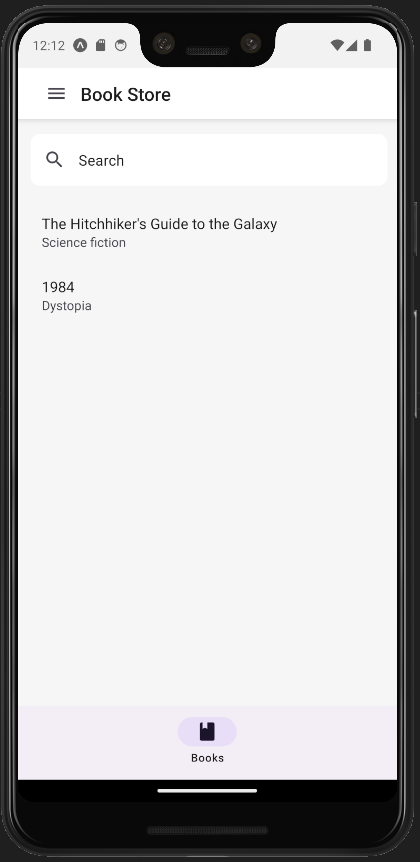
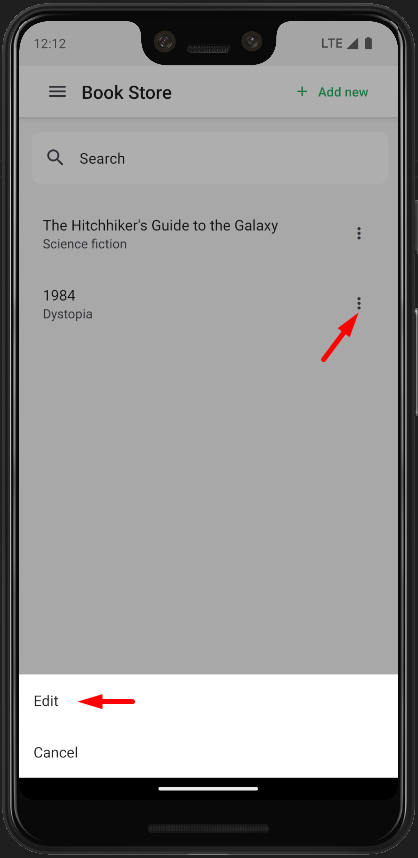
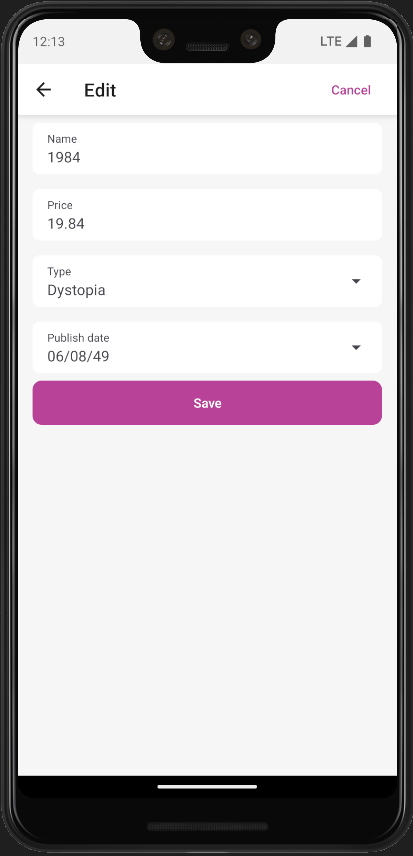
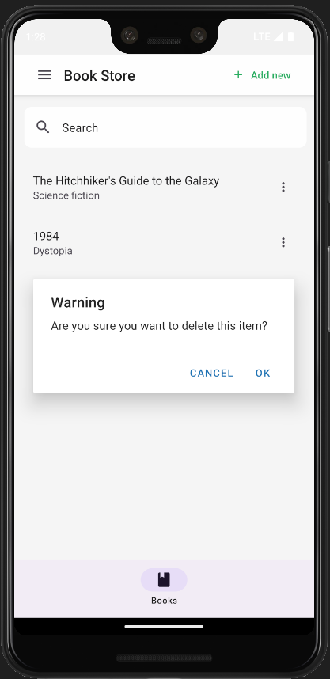
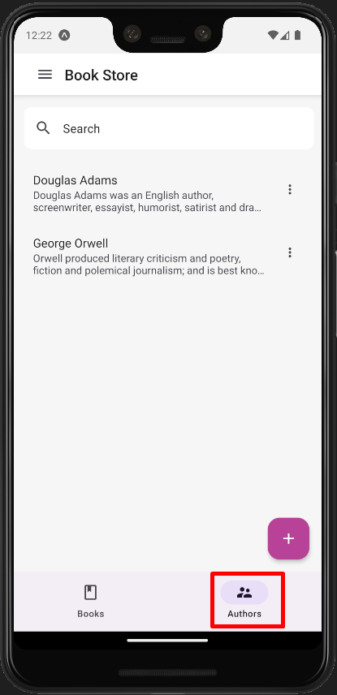
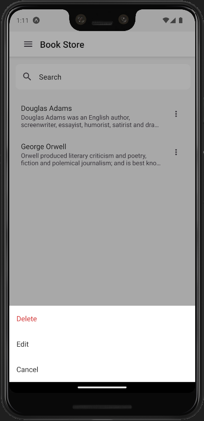
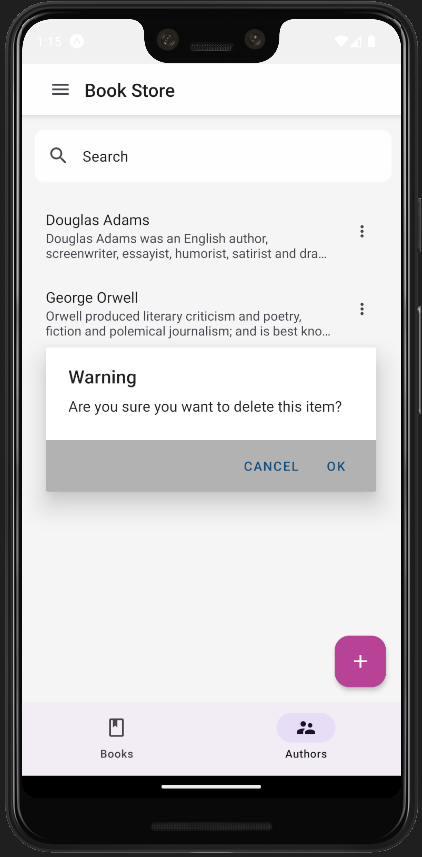

# Mobile Application Development Tutorial - React Native

## About This Tutorial

- This tutorial assumes that you have completed the [Web Application Development tutorial](../part-1.md) and built an ABP based application named `Acme.BookStore`. In this tutorial, we will only focus on the UI side of the `Acme.BookStore` application and will implement the CRUD operations.
- Before start please be sure the [React Native Development Environment](https://docs.abp.io/en/commercial/latest/getting-started-react-native) is ready on your machine.

## Download the Source Code

You can use the following link to download the source code of the application described in this article:

- [Acme.BookStore]()

> If you encounter the "filename too long" or "unzip" error on Windows, please see [this guide](https://docs.abp.io/en/abp/latest/KB/Windows-Path-Too-Long-Fix).

## The Book List Page

- In react native there is no dynamic proxy generation, that's why we need to create BookAPI proxy manually under the `src/api` folder.

```js
./src/api/BookAPI.js

import api from './API';

export const getList = () => api.get('/api/app/book').then(({ data }) => data);

export const get = id => api.get(`/api/app/book/${id}`).then(({ data }) => data);

export const create = input => api.post('/api/app/book', input).then(({ data }) => data);

export const update = (input, id) => api.put(`/api/app/book/${id}`, input).then(({ data }) => data);

export const remove = id => api.delete(`/api/app/book/${id}`).then(({ data }) => data);
```

- Add Book Store menu item to navigation

  - Add Screen to DrawerNavigator

  ```js
  ./src/navigators/DrawerNavigator.js

  //Other imports..
  import BookStoreStackNavigator from './BookStoreNavigator';

  const Drawer = createDrawerNavigator();

  export default function DrawerNavigator() {
    return (
      <Drawer.Navigator
        initialRouteName="Home"
        drawerContent={DrawerContent}
        defaultStatus="closed"
      >
        {/*Added Screen*/}
        <Drawer.Screen
          name="BookStoreStack"
          component={BookStoreStackNavigator}
          options={{ header: () => null }}
        />
        {/*Added Screen*/}
      </Drawer.Navigator>
    );
  }
  ```

  - Create BookStoreNavigator.js File

  ```js
  ./src/navigators/BookStoreNavigator.js file

  import React from "react";
  import { SafeAreaView } from "react-native-safe-area-context";
  import { createNativeStackNavigator } from "@react-navigation/native-stack";
  import i18n from "i18n-js";

  import HamburgerIcon from "../components/HamburgerIcon/HamburgerIcon";

  import BookStoreScreen from "../screens/Books/BookStoreScreen";

  const Stack = createNativeStackNavigator();

  export default function BookStoreStackNavigator() {
    return (
      <SafeAreaView style={{ flex: 1 }}>
        <Stack.Navigator initialRouteName="BookStore">
          <Stack.Screen
            name="BookStore"
            component={BookStoreScreen}
            options={({ navigation }) => ({
              title: i18n.t("BookStore::Menu:BookStore"),
              headerLeft: () => <HamburgerIcon navigation={navigation} />,
            })}
          />
        </Stack.Navigator>
      </SafeAreaView>
    );
  }
  ```

  - Add BookStoreStack to screens object

  ```js
  ./src/components/DrawerContent/DrawerContent.js

  // Imports..

  const screens = {
    HomeStack: { label: '::Menu:Home', iconName: 'home' },
    DashboardStack: {
        label: '::Menu:Dashboard',
        requiredPolicy: 'BookStore.Dashboard',
        iconName: 'chart-areaspline',
    },
    UsersStack: {
        label: 'AbpIdentity::Users',
        iconName: 'account-supervisor',
        requiredPolicy: 'AbpIdentity.Users',
    },

    //Add this property
    BookStoreStack: {
        label: 'BookStore::Menu:BookStore',
        iconName: 'book',
    },
    //Add this property

    TenantsStack: {
        label: 'Saas::Tenants',
        iconName: 'book-outline',
        requiredPolicy: 'Saas.Tenants',
    },
    SettingsStack: { label: 'AbpSettingManagement::Settings', iconName: 'cog', navigation: null },
  };

  // Other codes..
  ```

  

- `Create Book List page`

  - Create BookStoreScreen.js file

  ```js
  ./src/screens/BookStore/BookStoreScreen.js

  import React from 'react';
  import i18n from 'i18n-js';
  import { BottomNavigation } from 'react-native-paper';

  import BooksScreen from './Books/BooksScreen';

  const BooksRoute = () => <BooksScreen />;

  function BookStoreScreen({ navigation }) {
    const [index, setIndex] = React.useState(0);
    const [routes] = React.useState([
      {
        key: 'books',
        title: i18n.t('BookStore::Menu:Books'),
        focusedIcon: 'book',
        unfocusedIcon: 'book-outline',
      },
    ]);

    const renderScene = BottomNavigation.SceneMap({
      books: BooksRoute,
    });

    return (
      <BottomNavigation
        navigationState={{ index, routes }}
        onIndexChange={setIndex}
        renderScene={renderScene}
      />
    );
  }

  export default BookStoreScreen;
  ```

  ```js
  ./src/screens/BookStore/Books/BooksScreen.js

  import React from 'react';
  import { useSelector } from 'react-redux';
  import { View } from 'react-native';
  import { useTheme, List } from 'react-native-paper';
  import { getBooks } from '../../api/BookAPI';
  import i18n from 'i18n-js';

  import DataList from '../../components/DataList/DataList';
  import { createAppConfigSelector } from '../../store/selectors/AppSelectors';

  function BooksScreen({ navigation }) {
  const theme = useTheme();
  const currentUser = useSelector(createAppConfigSelector())?.currentUser;

  return (
    <View style={{ flex: 1, backgroundColor: theme.colors.background }}>
      {currentUser?.isAuthenticated && (
          <DataList
            navigation={navigation}
            fetchFn={getBooks}
            render={({ item }) => (
                <List.Item
                  key={item.id}
                  title={item.name}
                  description={i18n.t('BookStore::Enum:BookType.' + item.type)}
                />
            )}
          />
      )}
    </View>
   );
  }

  export default BooksScreen;
  ```

  - `getBooks` function used for fetching books from the server.
  - `i18n` api localize given key. It use incoming resource from `application-localization` endpoint.
  - `DataList` component takes `proxy method` for the fetch data and run the logic for lazy loading etc.

  ### Book List Page

  

## Creating a New Book

### Add `@react-native-community/datetimepicker` package for date picker.

```bash
yarn expo install @react-native-community/datetimepicker
```

```
npx expo install @react-native-community/datetimepicker
```

### Add Screen to BookStoreNavigator

```js
./src/navigators/BookStoreNavigator.js

import React from 'react';
import { SafeAreaView } from 'react-native-safe-area-context';
import { createNativeStackNavigator } from '@react-navigation/native-stack';

//Add here
import { Button } from 'react-native-paper';
//Add here

import i18n from 'i18n-js';

import HamburgerIcon from '../components/HamburgerIcon/HamburgerIcon';
import BookStoreScreen from '../screens/BookStore/BookStoreScreen';

//Add here
import CreateUpdateBookScreen from '../screens/BookStore/Books/CreateUpdateBook/CreateUpdateBookScreen';
//Add here

const Stack = createNativeStackNavigator();

export default function BookStoreStackNavigator() {
  return (
    <SafeAreaView style={{ flex: 1 }}>
      <Stack.Navigator initialRouteName="BookStore">
        <Stack.Screen
          name="BookStore"
          component={BookStoreScreen}
          options={({ navigation }) => ({
            title: i18n.t('BookStore::Menu:BookStore'),
            headerLeft: () => <HamburgerIcon navigation={navigation} />,
          })}
        />

        {/* Add here */}
        <Stack.Screen
          name="CreateUpdateBook"
          component={CreateUpdateBookScreen}
          options={({ route, navigation }) => ({
            title: i18n.t(route.params?.bookId ? 'BookStore::Edit' : 'BookStore::NewBook'),
            headerRight: () => (
              <Button mode="text" onPress={() => navigation.navigate('BookStore')}>
                {i18n.t('AbpUi::Cancel')}
              </Button>
            ),
          })}
        />
        {/* Add here */}
      </Stack.Navigator>
    </SafeAreaView>
  );
}
```

### Add create icon to BookScreen

```js
./src/screens/BookStore/BooksScreen.js

//Imports
import { rest imports.., StyleSheet } from 'react-native';
import { rest imports.., AnimatedFAB } from 'react-native-paper';


function BooksScreen({ navigation }) {
  //Other codes..


  return (
      <View style={{ flex: 1, backgroundColor: theme.colors.background }}>
        {/* Other codes..*/}


        {/* Included Code */}
        {currentUser?.isAuthenticated && (
          <AnimatedFAB
            icon={'plus'}
            label={i18n.t('BookStore::NewBook')}
            color="white"
            extended={false}
            onPress={() => navigation.navigate('CreateUpdateBook')}
            visible={true}
            animateFrom={'right'}
            iconMode={'static'}
            style={[styles.fabStyle, { backgroundColor: theme.colors.primary }]}
          />
        )}
        {/* Included Code */}
    </View>
  )
}

//Included Code
const styles = StyleSheet.create({
  container: {
    flexGrow: 1,
  },
  fabStyle: {
    bottom: 16,
    right: 16,
    position: 'absolute',
  },
});

export default BooksScreen;
```

### Add CreateUpdateBookScreen file

```js
./src/screens/BookStore/Books/CreateUpdateBook/CreateUpdateBookScreen.js

import PropTypes from 'prop-types';
import React from 'react';

import { create } from '../../../../api/BookAPI';
import LoadingActions from '../../../../store/actions/LoadingActions';
import { createLoadingSelector } from '../../../../store/selectors/LoadingSelectors';
import { connectToRedux } from '../../../../utils/ReduxConnect';
import CreateUpdateBookForm from './CreateUpdateBookForm';

function CreateUpdateBookScreen({ navigation, startLoading, clearLoading }) {
  const submit = data => {
    startLoading({ key: 'save' });

    create(data)
      .then(() => navigation.goBack())
      .finally(() => clearLoading());
  };

  return <CreateUpdateBookForm submit={submit} />;
}

CreateUpdateBookScreen.propTypes = {
  startLoading: PropTypes.func.isRequired,
  clearLoading: PropTypes.func.isRequired,
};

export default connectToRedux({
  component: CreateUpdateBookScreen,
  stateProps: state => ({ loading: createLoadingSelector()(state) }),
  dispatchProps: {
    startLoading: LoadingActions.start,
    clearLoading: LoadingActions.clear,
  },
});

```

- In this page we'll store logic, send post request getting selected book data etc.
- This page will wrap `CreateUpdateBookFrom` component and pass submit function with other props.

### Add CreateUpdateBookForm file

```js
./src/screens/BookStore/Books/CreateUpdateBook/CreateUpdateBookForm.js

import React, { useRef, useState } from 'react';
import { Platform, KeyboardAvoidingView, StyleSheet, View, ScrollView } from 'react-native';

import { useFormik } from 'formik';
import i18n from 'i18n-js';
import PropTypes from 'prop-types';
import * as Yup from 'yup';
import { useTheme, TextInput } from 'react-native-paper';
import DateTimePicker from '@react-native-community/datetimepicker';

import { FormButtons } from '../../../../components/FormButtons';
import ValidationMessage from '../../../../components/ValidationMessage/ValidationMessage';
import AbpSelect from '../../../../components/Select/Select';

const validations = {
  name: Yup.string().required('AbpValidation::ThisFieldIsRequired.'),
  price: Yup.number().required('AbpValidation::ThisFieldIsRequired.'),
  type: Yup.string().nullable().required('AbpValidation::ThisFieldIsRequired.'),
  publishDate: Yup.string().nullable().required('AbpValidation::ThisFieldIsRequired.'),
};

const props = {
  underlineStyle: { backgroundColor: 'transparent' },
  underlineColor: '#333333bf',
};

function CreateUpdateBookForm({ submit }) {
  const theme = useTheme();

  const [bookTypeVisible, setBookTypeVisible] = useState(false);
  const [publishDateVisible, setPublishDateVisible] = useState(false);

  const nameRef = useRef();
  const priceRef = useRef();
  const typeRef = useRef();
  const publishDateRef = useRef();

  const inputStyle = { ...styles.input, backgroundColor: theme.colors.primaryContainer };
  const bookTypes = new Array(8)
    .fill(0)
    .map((_, i) => ({ id: i + 1, displayName: i18n.t(`BookStore::Enum:BookType.${i + 1}`) }));

  const onSubmit = values => {
    if (!bookForm.isValid) {
      return;
    }

    submit({ ...values });
  };

  const bookForm = useFormik({
    enableReinitialize: true,
    validateOnBlur: true,
    validationSchema: Yup.object().shape({
      ...validations,
    }),
    initialValues: {
      name: '',
      price: '',
      type: '',
      publishDate: null,
    },
    onSubmit,
  });

  const isInvalidControl = (controlName = null) => {
    if (!controlName) {
      return;
    }

    return (
      ((!!bookForm.touched[controlName] && bookForm.submitCount > 0) || bookForm.submitCount > 0) &&
      !!bookForm.errors[controlName]
    );
  };

  const onChange = (event, selectedDate) => {
    if (!selectedDate) {
      return;
    }

    setPublishDateVisible(false);

    if (event && event.type !== 'dismissed') {
      bookForm.setFieldValue('publishDate', selectedDate, true);
    }
  };

  return (
    <View style={{ flex: 1, backgroundColor: theme.colors.background }}>
      <AbpSelect
        key="typeSelect"
        title={i18n.t('BookStore::Type')}
        visible={bookTypeVisible}
        items={bookTypes}
        hasDefualtItem={true}
        hideModalFn={() => setBookTypeVisible(false)}
        selectedItem={bookForm.values.type}
        setSelectedItem={id => {
          bookForm.setFieldValue('type', id, true);
          bookForm.setFieldValue(
            'typeDisplayName',
            bookTypes.find(f => f.id === id)?.displayName || null,
            false,
          );
        }}
      />
      {publishDateVisible && (
        <DateTimePicker
          testID="publishDatePicker"
          value={bookForm.values.publishDate || new Date()}
          mode={'date'}
          is24Hour={true}
          onChange={onChange}
        />
      )}

      <KeyboardAvoidingView behavior={Platform.OS === 'ios' ? 'padding' : 'margin'}>
        <ScrollView keyboardShouldPersistTaps="handled">
          <View style={styles.input.container}>
            <TextInput
              mode="flat"
              ref={nameRef}
              error={isInvalidControl('name')}
              onSubmitEditing={() => priceRef.current.focus()}
              returnKeyType="next"
              onChangeText={bookForm.handleChange('name')}
              onBlur={bookForm.handleBlur('name')}
              value={bookForm.values.name}
              autoCapitalize="none"
              label={i18n.t('BookStore::Name')}
              style={inputStyle}
              {...props}
            />
            {isInvalidControl('name') && (
              <ValidationMessage>{bookForm.errors.name}</ValidationMessage>
            )}
          </View>

          <View style={styles.input.container}>
            <TextInput
              mode="flat"
              ref={priceRef}
              error={isInvalidControl('price')}
              onSubmitEditing={() => typeRef.current.focus()}
              returnKeyType="next"
              onChangeText={bookForm.handleChange('price')}
              onBlur={bookForm.handleBlur('price')}
              value={bookForm.values.price}
              autoCapitalize="none"
              label={i18n.t('BookStore::Price')}
              style={inputStyle}
              {...props}
            />
            {isInvalidControl('price') && (
              <ValidationMessage>{bookForm.errors.price}</ValidationMessage>
            )}
          </View>

          <View style={styles.input.container}>
            <TextInput
              ref={typeRef}
              label={i18n.t('BookStore::Type')}
              right={<TextInput.Icon onPress={() => setBookTypeVisible(true)} icon="menu-down" />}
              style={inputStyle}
              editable={false}
              value={bookForm.values.typeDisplayName}
              {...props}
            />
            {isInvalidControl('type') && (
              <ValidationMessage>{bookForm.errors.type}</ValidationMessage>
            )}
          </View>

          <View style={styles.input.container}>
            <TextInput
              ref={publishDateRef}
              label={i18n.t('BookStore::PublishDate')}
              right={
                <TextInput.Icon onPress={() => setPublishDateVisible(true)} icon="menu-down" />
              }
              style={inputStyle}
              editable={false}
              value={bookForm.values.publishDate?.toLocaleDateString()}
              {...props}
            />
            {isInvalidControl('publishDate') && (
              <ValidationMessage>{bookForm.errors.publishDate}</ValidationMessage>
            )}
          </View>

          <FormButtons style={styles.button} submit={bookForm.handleSubmit} />
        </ScrollView>
      </KeyboardAvoidingView>
    </View>
  );
}

const styles = StyleSheet.create({
  input: {
    container: {
      margin: 8,
      marginLeft: 16,
      marginRight: 16,
    },
    borderRadius: 8,
    borderTopLeftRadius: 8,
    borderTopRightRadius: 8,
  },
  button: {
    marginLeft: 16,
    marginRight: 16,
  },
});

CreateUpdateBookForm.propTypes = {
  submit: PropTypes.func.isRequired,
};

export default CreateUpdateBookForm;
```

- `formik` will manage form state, validation and value changes.
- `Yup` allows the build validation schema.
- `AbpSelect` component used for select book type.
- `submit` method will pass form values to `CreateUpdateBookScreen` component.


## Update a Book

### Update `BookStoreScreen.js` file

```js
//Imports..

//Add navigation parameter
const BooksRoute = (nav) => <BooksScreen navigation={nav} />;

function BookStoreScreen({ navigation }) {
  //Other codes..

  const renderScene = BottomNavigation.SceneMap({
    books: () => BooksRoute(navigation), //Use this way
  });

  //Other codes..
}

export default BookStoreScreen;
```

### Paste code below to the `BookScreen.js` file

```js
./src/screens/BookStore/Books/BooksScreen.js

import React from 'react';
import { useSelector } from 'react-redux';
import { Alert, View, StyleSheet } from 'react-native';
import { useTheme, List, IconButton, AnimatedFAB } from 'react-native-paper';
import { useActionSheet } from '@expo/react-native-action-sheet';
import i18n from 'i18n-js';

import { getList } from '../../../api/BookAPI';
import DataList from '../../../components/DataList/DataList';
import { createAppConfigSelector } from '../../../store/selectors/AppSelectors';

function BooksScreen({ navigation }) {
  const theme = useTheme();
  const currentUser = useSelector(createAppConfigSelector())?.currentUser;
  const { showActionSheetWithOptions } = useActionSheet();

  const openContextMenu = item => {
    const options = [];

    options.push(i18n.t('AbpUi::Edit'));
    options.push(i18n.t('AbpUi::Cancel'));

    showActionSheetWithOptions(
      {
        options,
        cancelButtonIndex: options.length - 1,
        destructiveButtonIndex: options.indexOf(i18n.t('AbpUi::Delete')),
      },
      index => {
        switch (options[index]) {
          case i18n.t('AbpUi::Edit'):
            edit(item);
            break;
          case i18n.t('AbpUi::Delete'):
            remove(item);
            break;
        }
      },
    );
  };

  const edit = item => {
    navigation.navigate('CreateUpdateBook', { bookId: item.id });
  };

  return (
    <View style={{ flex: 1, backgroundColor: theme.colors.background }}>
      {currentUser?.isAuthenticated && (
        <DataList
          navigation={navigation}
          fetchFn={getList}
          render={({ item }) => (
            <List.Item
              key={item.id}
              title={item.name}
              description={i18n.t('BookStore::Enum:BookType.' + item.type)}
              right={props => (
                <IconButton
                  {...props}
                  icon="dots-vertical"
                  rippleColor={'#ccc'}
                  size={20}
                  onPress={() => openContextMenu(item)}
                />
              )}
            />
          )}
        />
      )}

      {currentUser?.isAuthenticated && policies['BookStore.Books.Create'] && (
        <AnimatedFAB
          icon={'plus'}
          label={i18n.t('BookStore::NewBook')}
          color="white"
          extended={false}
          onPress={() => navigation.navigate('CreateUpdateBook')}
          visible={true}
          animateFrom={'right'}
          iconMode={'static'}
          style={[styles.fabStyle, { backgroundColor: theme.colors.primary }]}
        />
      )}
    </View>
  );
}

const styles = StyleSheet.create({
  container: {
    flexGrow: 1,
  },
  fabStyle: {
    bottom: 16,
    right: 16,
    position: 'absolute',
  },
});

export default BooksScreen;
```

### Replace code below for `CreateUpdateBookScreen.js` file

```js
./src/screens/BookStore/Books/CreateUpdateBook/CreateUpdateBookScreen.js

import PropTypes from "prop-types";
import React, { useEffect, useState } from "react";

import { get, create, update } from "../../../../api/BookAPI";
import LoadingActions from "../../../../store/actions/LoadingActions";
import { createLoadingSelector } from "../../../../store/selectors/LoadingSelectors";
import { connectToRedux } from "../../../../utils/ReduxConnect";
import CreateUpdateBookForm from "./CreateUpdateBookForm";

function CreateUpdateBookScreen({
  navigation,
  route,
  startLoading,
  clearLoading,
}) {
  const { bookId } = route.params || {};
  const [book, setBook] = useState(null);

  const submit = (data) => {
    startLoading({ key: "save" });

    (data.id ? update(data, data.id) : create(data))
      .then(() => navigation.goBack())
      .finally(() => clearLoading());
  };

  useEffect(() => {
    if (bookId) {
      startLoading({ key: "fetchBookDetail" });

      get(bookId)
        .then((response) => setBook(response))
        .finally(() => clearLoading());
    }
  }, [bookId]);

  return <CreateUpdateBookForm submit={submit} book={book} />;
}

CreateUpdateBookScreen.propTypes = {
  startLoading: PropTypes.func.isRequired,
  clearLoading: PropTypes.func.isRequired,
};

export default connectToRedux({
  component: CreateUpdateBookScreen,
  stateProps: (state) => ({ loading: createLoadingSelector()(state) }),
  dispatchProps: {
    startLoading: LoadingActions.start,
    clearLoading: LoadingActions.clear,
  },
});
```

- `get` method used for fetching book detail from the server.
- `update` method used for updating book on the server.
- `route` parameter will used for getting bookId from navigation.

### Update `CreateUpdateBookForm.js` file

```js
./src/screens/BookStore/Books/CreateUpdateBook/CreateUpdateBookForm.js

//Imports..

//validateSchema

//props

function CreateUpdateBookForm({
  submit,
  book = null, //Add book parameter with default value
}) {
  //Other codes..

  const bookForm = useFormik({
    enableReinitialize: true,
    validateOnBlur: true,
    validationSchema: Yup.object().shape({
      ...validations,
    }),
    initialValues: {
      //Update initialValues
      ...book,
      name: book?.name || '',
      price: book?.price.toString() || '',
      type: book?.type || '',
      typeDisplayName: book?.type && i18n.t('BookStore::Enum:BookType.' + book.type),
      publishDate: (book?.publishDate && new Date(book?.publishDate)) || null,
      //Update initialValues
    },
    onSubmit,
  });

  //Others codes..
}

//Other codes..
```





## Delete a Book

### Add `Delete` option

```js
./src/screens/BookStore/Books/BooksScreen.js

import React, { useState } from 'react';
import { useSelector } from 'react-redux';
import { Alert, View, StyleSheet } from 'react-native';
import { useTheme, List, IconButton, AnimatedFAB } from 'react-native-paper';
import { useActionSheet } from '@expo/react-native-action-sheet';
import i18n from 'i18n-js';

import { getList, remove } from '../../../api/BookAPI';
import DataList from '../../../components/DataList/DataList';
import { createAppConfigSelector } from '../../../store/selectors/AppSelectors';

function BooksScreen({ navigation }) {
  const theme = useTheme();
  const currentUser = useSelector(createAppConfigSelector())?.currentUser;

  const [refresh, setRefresh] = useState(null);
  const { showActionSheetWithOptions } = useActionSheet();

  const openContextMenu = item => {
    const options = [];

    options.push(i18n.t('AbpUi::Delete'));
    options.push(i18n.t('AbpUi::Edit'));
    options.push(i18n.t('AbpUi::Cancel'));

    showActionSheetWithOptions(
      {
        options,
        cancelButtonIndex: options.length - 1,
        destructiveButtonIndex: options.indexOf(i18n.t('AbpUi::Delete')),
      },
      index => {
        switch (options[index]) {
          case i18n.t('AbpUi::Edit'):
            edit(item);
            break;
          case i18n.t('AbpUi::Delete'):
            removeOnClick(item);
            break;
        }
      },
    );
  };

  const removeOnClick = item => {
    Alert.alert('Warning', i18n.t('BookStore::AreYouSureToDelete'), [
      {
        text: i18n.t('AbpUi::Cancel'),
        style: 'cancel',
      },
      {
        style: 'default',
        text: i18n.t('AbpUi::Ok'),
        onPress: () => {
          remove(item.id).then(() => {
            setRefresh((refresh ?? 0) + 1);
          });
        },
      },
    ]);
  };

  const edit = item => {
    navigation.navigate('CreateUpdateBook', { bookId: item.id });
  };

  return (
    <View style={{ flex: 1, backgroundColor: theme.colors.background }}>
      {currentUser?.isAuthenticated && (
        <DataList
          navigation={navigation}
          fetchFn={getList}
          trigger={refresh}
          render={({ item }) => (
            <List.Item
              key={item.id}
              title={item.name}
              description={i18n.t('BookStore::Enum:BookType.' + item.type)}
              right={props => (
                <IconButton
                  {...props}
                  icon="dots-vertical"
                  rippleColor={'#ccc'}
                  size={20}
                  onPress={() => openContextMenu(item)}
                />
              )}
            />
          )}
        />
      )}

      {currentUser?.isAuthenticated && policies['BookStore.Books.Create'] && (
        <AnimatedFAB
          icon={'plus'}
          label={i18n.t('BookStore::NewBook')}
          color="white"
          extended={false}
          onPress={() => navigation.navigate('CreateUpdateBook')}
          visible={true}
          animateFrom={'right'}
          iconMode={'static'}
          style={[styles.fabStyle, { backgroundColor: theme.colors.primary }]}
        />
      )}
    </View>
  );
}

const styles = StyleSheet.create({
  container: {
    flexGrow: 1,
  },
  fabStyle: {
    bottom: 16,
    right: 16,
    position: 'absolute',
  },
});

export default BooksScreen;
```




## Authorization

### Hide Books item in tab

```js
./src/screens/BookStore/Books/BookStoreScreen.js

//Other imports..
import { useSelector } from 'react-redux';

function BookStoreScreen({ navigation }) {
  const [index, setIndex] = React.useState(0);
  const [routes, setRoutes] = React.useState([]);

  const currentUser = useSelector(state => state.app.appConfig.currentUser);
  const policies = useSelector(state => state.app.appConfig.auth.grantedPolicies);

  const renderScene = BottomNavigation.SceneMap({
    books: () => BooksRoute(navigation),
  });

  React.useEffect(() => {
    if (!currentUser?.isAuthenticated || !policies) {
      setRoutes([]);
      return;
    }

    let _routes = [];

    if (!!policies['BookStore.Books']) {
      _routes.push({
        key: 'books',
        title: i18n.t('BookStore::Menu:Books'),
        focusedIcon: 'book',
        unfocusedIcon: 'book-outline',
      });
    }

    setRoutes([..._routes]);
  }, [Object.keys(policies)?.filter(f => f.startsWith('BookStore')).length]);

  return (
    routes?.length > 0 && (
      <BottomNavigation
        navigationState={{ index, routes }}
        onIndexChange={setIndex}
        renderScene={renderScene}
      />
    )
  );
}

export default BookStoreScreen;
```


### Hide the New Book Button

```js
./src/screens/BookStore/Books/BooksScreen.js

//Imports..

function BooksScreen({ navigation }) {
  const policies = useSelector(createAppConfigSelector())?.auth?.grantedPolicies;

  //Other codes..

  return (
    {/*Other codes..*/}

    {currentUser?.isAuthenticated &&
      !!policies['BookStore.Books.Create'] && //Add this line
      (
        <AnimatedFAB
          icon={'plus'}
          label={i18n.t('BookStore::NewBook')}
          color="white"
          extended={false}
          onPress={() => navigation.navigate('CreateUpdateBook')}
          visible={true}
          animateFrom={'right'}
          iconMode={'static'}
          style={[styles.fabStyle, { backgroundColor: theme.colors.primary }]}
        />
      )
    }
  )
}
```


### Hide the Edit and Delete Actions

```js
./src/screens/BookStore/Books/BooksScreen.js

function BooksScreen() {
  //...

  const openContextMenu = (item) => {
    const options = [];

    if (policies["BookStore.Books.Delete"]) {
      options.push(i18n.t("AbpUi::Delete"));
    }

    if (policies["BookStore.Books.Update"]) {
      options.push(i18n.t("AbpUi::Edit"));
    }

    options.push(i18n.t("AbpUi::Cancel"));
  };

  //...
}
```


## Author

### Create API Proxy

```js
./src/api/AuthorAPI.js

import api from './API';

export const getList = () => api.get('/api/app/author').then(({ data }) => data);

export const get = id => api.get(`/api/app/author/${id}`).then(({ data }) => data);

export const create = input => api.post('/api/app/author', input).then(({ data }) => data);

export const update = (input, id) => api.put(`/api/app/author/${id}`, input).then(({ data }) => data);

export const remove = id => api.delete(`/api/app/author/${id}`).then(({ data }) => data);
```

## The Author List Page

### Add Authors Tab to BookStoreScreen

```js
./src/screens/BookStore/BookStoreScreen.js

//Other imports
import AuthorsScreen from './Authors/AuthorsScreen';

//Other Routes..
const AuthorsRoute = nav => <AuthorsScreen navigation={nav} />;


function BookStoreScreen({ navigation }) {
  //Other codes..

 const renderScene = BottomNavigation.SceneMap({
    books: () => BooksRoute(navigation),
    authors: () => AuthorsRoute(navigation),//Added this line
  });


  //Added this
  if (!!policies['BookStore.Authors']) {
      _routes.push({
        key: 'authors',
        title: i18n.t('BookStore::Menu:Authors'),
        focusedIcon: 'account-supervisor',
        unfocusedIcon: 'account-supervisor-outline',
      });
    }
  //Added this

}

export default BookStoreScreen;
```

### Add `AuthorsScreen.js` file

```js
./src/screens/BookStore/Authors/AuthorsScreen.js

import React, { useState } from 'react';
import { useSelector } from 'react-redux';
import { Alert, View, StyleSheet } from 'react-native';
import { useTheme, List, IconButton, AnimatedFAB } from 'react-native-paper';
import { useActionSheet } from '@expo/react-native-action-sheet';
import i18n from 'i18n-js';

import { getList, remove } from '../../../api/AuthorAPI';
import DataList from '../../../components/DataList/DataList';
import { createAppConfigSelector } from '../../../store/selectors/AppSelectors';

function AuthorsScreen({ navigation }) {
  const theme = useTheme();
  const currentUser = useSelector(createAppConfigSelector())?.currentUser;
  const policies = useSelector(createAppConfigSelector())?.auth?.grantedPolicies;

  const [refresh, setRefresh] = useState(null);
  const { showActionSheetWithOptions } = useActionSheet();

  const openContextMenu = item => {
    const options = [];

    if (policies['BookStore.Authors.Delete']) {
      options.push(i18n.t('AbpUi::Delete'));
    }

    if (policies['BookStore.Authors.Edit']) {
      options.push(i18n.t('AbpUi::Edit'));
    }

    options.push(i18n.t('AbpUi::Cancel'));

    showActionSheetWithOptions(
      {
        options,
        cancelButtonIndex: options.length - 1,
        destructiveButtonIndex: options.indexOf(i18n.t('AbpUi::Delete')),
      },
      index => {
        switch (options[index]) {
          case i18n.t('AbpUi::Edit'):
            edit(item);
            break;
          case i18n.t('AbpUi::Delete'):
            removeOnClick(item);
            break;
        }
      },
    );
  };

  const removeOnClick = ({ id } = {}) => {
    Alert.alert('Warning', i18n.t('BookStore::AreYouSureToDelete'), [
      {
        text: i18n.t('AbpUi::Cancel'),
        style: 'cancel',
      },
      {
        style: 'default',
        text: i18n.t('AbpUi::Ok'),
        onPress: () => {
          remove(id).then(() => {
            setRefresh((refresh ?? 0) + 1);
          });
        },
      },
    ]);
  };

  const edit = ({ id } = {}) => {
    navigation.navigate('CreateUpdateAuthor', { authorId: id });
  };

  return (
    <View style={{ flex: 1, backgroundColor: theme.colors.background }}>
      {currentUser?.isAuthenticated && (
        <DataList
          navigation={navigation}
          fetchFn={getList}
          trigger={refresh}
          render={({ item }) => (
            <List.Item
              key={item.id}
              title={item.name}
              description={item.shortBio || new Date(item.birthDate)?.toLocaleDateString()}
              right={props => (
                <IconButton
                  {...props}
                  icon="dots-vertical"
                  rippleColor={'#ccc'}
                  size={20}
                  onPress={() => openContextMenu(item)}
                />
              )}
            />
          )}
        />
      )}

      {currentUser?.isAuthenticated && policies['BookStore.Authors.Create'] && (
        <AnimatedFAB
          icon={'plus'}
          label={i18n.t('BookStore::NewAuthor')}
          color="white"
          extended={false}
          onPress={() => navigation.navigate('CreateUpdateAuthor')}
          visible={true}
          animateFrom={'right'}
          iconMode={'static'}
          style={[styles.fabStyle, { backgroundColor: theme.colors.primary }]}
        />
      )}
    </View>
  );
}

const styles = StyleSheet.create({
  container: {
    flexGrow: 1,
  },
  fabStyle: {
    bottom: 16,
    right: 16,
    position: 'absolute',
  },
});

export default AuthorsScreen;

```

### Add `CreateUpdateAuthorScreen.js` file

```js
./src/screens/BookStore/Authors/CreateUpdateAuthor/CreateUpdateAuthorScreen.js
import PropTypes from 'prop-types';
import React, { useEffect, useState } from 'react';

import { get, create, update } from '../../../../api/AuthorAPI';
import LoadingActions from '../../../../store/actions/LoadingActions';
import { createLoadingSelector } from '../../../../store/selectors/LoadingSelectors';
import { connectToRedux } from '../../../../utils/ReduxConnect';
import CreateUpdateAuthorForm from './CreateUpdateAuthorForm';

function CreateUpdateAuthorScreen({ navigation, route, startLoading, clearLoading }) {
  const { authorId } = route.params || {};
  const [author, setAuthor] = useState(null);

  const submit = data => {
    startLoading({ key: 'save' });

    (data.id ? update(data, data.id) : create(data))
      .then(() => navigation.goBack())
      .finally(() => clearLoading());
  };

  useEffect(() => {
    if (authorId) {
      startLoading({ key: 'fetchAuthorDetail' });

      get(authorId)
        .then(response => setAuthor(response))
        .finally(() => clearLoading());
    }
  }, [authorId]);

  return <CreateUpdateAuthorForm submit={submit} author={author} />;
}

CreateUpdateAuthorScreen.propTypes = {
  startLoading: PropTypes.func.isRequired,
  clearLoading: PropTypes.func.isRequired,
};

export default connectToRedux({
  component: CreateUpdateAuthorScreen,
  stateProps: state => ({ loading: createLoadingSelector()(state) }),
  dispatchProps: {
    startLoading: LoadingActions.start,
    clearLoading: LoadingActions.clear,
  },
});
```

### Add `CreateUpdateAuthorForm.js` file

```js
import React, { useRef, useState } from "react";
import {
  Platform,
  KeyboardAvoidingView,
  StyleSheet,
  View,
  ScrollView,
} from "react-native";

import { useFormik } from "formik";
import i18n from "i18n-js";
import PropTypes from "prop-types";
import * as Yup from "yup";
import { useTheme, TextInput } from "react-native-paper";
import DateTimePicker from "@react-native-community/datetimepicker";

import { FormButtons } from "../../../../components/FormButtons";
import ValidationMessage from "../../../../components/ValidationMessage/ValidationMessage";

const validations = {
  name: Yup.string().required("AbpValidation::ThisFieldIsRequired."),
  birthDate: Yup.string()
    .nullable()
    .required("AbpValidation::ThisFieldIsRequired."),
};

const props = {
  underlineStyle: { backgroundColor: "transparent" },
  underlineColor: "#333333bf",
};

function CreateUpdateAuthorForm({ submit, author = null }) {
  const theme = useTheme();

  const [birthDateVisible, setPublishDateVisible] = useState(false);

  const nameRef = useRef();
  const birthDateRef = useRef();
  const shortBioRef = useRef();

  const inputStyle = {
    ...styles.input,
    backgroundColor: theme.colors.primaryContainer,
  };

  const onSubmit = (values) => {
    if (!authorForm.isValid) {
      return;
    }

    submit({ ...values });
  };

  const authorForm = useFormik({
    enableReinitialize: true,
    validateOnBlur: true,
    validationSchema: Yup.object().shape({
      ...validations,
    }),
    initialValues: {
      ...author,
      name: author?.name || "",
      birthDate: (author?.birthDate && new Date(author?.birthDate)) || null,
      shortBio: author?.shortBio || "",
    },
    onSubmit,
  });

  const isInvalidControl = (controlName = null) => {
    if (!controlName) {
      return;
    }

    return (
      ((!!authorForm.touched[controlName] && authorForm.submitCount > 0) ||
        authorForm.submitCount > 0) &&
      !!authorForm.errors[controlName]
    );
  };

  const onChange = (event, selectedDate) => {
    if (!selectedDate) {
      return;
    }

    setPublishDateVisible(false);

    if (event && event.type !== "dismissed") {
      authorForm.setFieldValue("birthDate", selectedDate, true);
    }
  };

  return (
    <View style={{ flex: 1, backgroundColor: theme.colors.background }}>
      {birthDateVisible && (
        <DateTimePicker
          testID="birthDatePicker"
          value={authorForm.values.birthDate || new Date()}
          mode={"date"}
          is24Hour={true}
          onChange={onChange}
        />
      )}

      <KeyboardAvoidingView
        behavior={Platform.OS === "ios" ? "padding" : "margin"}
      >
        <ScrollView keyboardShouldPersistTaps="handled">
          <View style={styles.input.container}>
            <TextInput
              mode="flat"
              ref={nameRef}
              error={isInvalidControl("name")}
              onSubmitEditing={() => birthDateRef.current.focus()}
              returnKeyType="next"
              onChangeText={authorForm.handleChange("name")}
              onBlur={authorForm.handleBlur("name")}
              value={authorForm.values.name}
              autoCapitalize="none"
              label={i18n.t("BookStore::Name")}
              style={inputStyle}
              {...props}
            />
            {isInvalidControl("name") && (
              <ValidationMessage>{authorForm.errors.name}</ValidationMessage>
            )}
          </View>

          <View style={styles.input.container}>
            <TextInput
              ref={birthDateRef}
              label={i18n.t("BookStore::BirthDate")}
              onSubmitEditing={() => shortBioRef.current.focus()}
              right={
                <TextInput.Icon
                  onPress={() => setPublishDateVisible(true)}
                  icon="menu-down"
                />
              }
              style={inputStyle}
              editable={false}
              value={authorForm.values.birthDate?.toLocaleDateString()}
              {...props}
            />
            {isInvalidControl("birthDate") && (
              <ValidationMessage>
                {authorForm.errors.birthDate}
              </ValidationMessage>
            )}
          </View>

          <View style={styles.input.container}>
            <TextInput
              mode="flat"
              ref={shortBioRef}
              error={isInvalidControl("shortBio")}
              onSubmitEditing={() => authorForm.handleSubmit()}
              returnKeyType="next"
              onChangeText={authorForm.handleChange("shortBio")}
              onBlur={authorForm.handleBlur("shortBio")}
              value={authorForm.values.shortBio}
              autoCapitalize="none"
              label={i18n.t("BookStore::ShortBio")}
              style={inputStyle}
              {...props}
            />
          </View>

          <FormButtons style={styles.button} submit={authorForm.handleSubmit} />
        </ScrollView>
      </KeyboardAvoidingView>
    </View>
  );
}

const styles = StyleSheet.create({
  input: {
    container: {
      margin: 8,
      marginLeft: 16,
      marginRight: 16,
    },
    borderRadius: 8,
    borderTopLeftRadius: 8,
    borderTopRightRadius: 8,
  },
  button: {
    marginLeft: 16,
    marginRight: 16,
  },
});

CreateUpdateAuthorForm.propTypes = {
  author: PropTypes.object,
  submit: PropTypes.func.isRequired,
};

export default CreateUpdateAuthorForm;
```









## Add `Author` Relation To Book

### Add `getAuthorLookup` method to BookAPI proxy

```js
import api from "./API";

export const getList = () => api.get("/api/app/book").then(({ data }) => data);

//Add this
export const getAuthorLookup = () =>
  api.get("/api/app/book/author-lookup").then(({ data }) => data);
//Add this

export const get = (id) =>
  api.get(`/api/app/book/${id}`).then(({ data }) => data);

export const create = (input) =>
  api.post("/api/app/book", input).then(({ data }) => data);

export const update = (input, id) =>
  api.put(`/api/app/book/${id}`, input).then(({ data }) => data);

export const remove = (id) =>
  api.delete(`/api/app/book/${id}`).then(({ data }) => data);
```

### Add AuthorName to Book List

```js
./src/screens/BookStore/Books/BooksScreen.js

//Improts

function BooksScreen({ navigation }) {
  //Other codes..


  return (
    //Other codes
    <DataList
          navigation={navigation}
          fetchFn={getList}
          trigger={refresh}
          render={({ item }) => (
          <List.Item
            key={item.id}
            title={item.name}
            //Update here
            description={`${item.authorName} | ${i18n.t(
              'BookStore::Enum:BookType.' + item.type,
            )}`}
            //Update here
            right={props => (
              <IconButton
                {...props}
                icon="dots-vertical"
                rippleColor={'#ccc'}
                size={20}
                onPress={() => openContextMenu(item)}
              />
            )}
          />
        )}
      />
    //Other codes
  );
}
```

### Create `authors` variable to CreateUpdateBookScreen

```js
import {
  getAuthorLookup, //Add this line
  get,
  create,
  update,
} from "../../../../api/BookAPI";

function CreateUpdateBookScreen({
  navigation,
  route,
  startLoading,
  clearLoading,
}) {
  //Add this variable
  const [authors, setAuthors] = useState([]);

  //Fetch authors from author-lookup endpoint
  useEffect(() => {
    getAuthorLookup().then(({ items } = {}) => setAuthors(items));
  }, []);

  //Pass author list to Form
  return <CreateUpdateBookForm submit={submit} book={book} authors={authors} />;
}
//Other codes..
```

### Add `authorId` field to Book Form

```js
const validations = {
  authorId: Yup.string()
    .nullable()
    .required("AbpValidation::ThisFieldIsRequired."),
  //Other validators
};

//Add `authors` parameter
function CreateUpdateBookForm({ submit, book = null, authors = [] }) {
  //Add this variable for authors list
  const [authorSelectVisible, setAuthorSelectVisible] = useState(false);

  const authorIdRef = useRef(); //Add this line

  //Update form
  const bookForm = useFormik({
    enableReinitialize: true,
    validateOnBlur: true,
    validationSchema: Yup.object().shape({
      ...validations,
    }),
    initialValues: {
      //Add these
      authorId: book?.authorId || "",
      author: authors.find((f) => f.id === book?.authorId)?.name || "",
      //Add these
    },
    onSubmit,
  });

  //Other codes..

  //Add `AbpSelect` component and TextInput for authors
  return (
    <View style={{ flex: 1, backgroundColor: theme.colors.background }}>
      <AbpSelect
        key="authorSelect"
        title={i18n.t("BookStore::Authors")}
        visible={authorSelectVisible}
        items={authors.map(({ id, name }) => ({ id, displayName: name }))}
        hasDefualtItem={true}
        hideModalFn={() => setAuthorSelectVisible(false)}
        selectedItem={bookForm.values.authorId}
        setSelectedItem={(id) => {
          bookForm.setFieldValue("authorId", id, true);
          bookForm.setFieldValue(
            "author",
            authors.find((f) => f.id === id)?.name || null,
            false
          );
        }}
      />

      <KeyboardAvoidingView
        behavior={Platform.OS === "ios" ? "padding" : "margin"}
      >
        <ScrollView keyboardShouldPersistTaps="handled">
          <View style={styles.input.container}>
            <TextInput
              ref={authorIdRef}
              error={isInvalidControl("authorId")}
              label={i18n.t("BookStore::Author")}
              right={
                <TextInput.Icon
                  onPress={() => setAuthorSelectVisible(true)}
                  icon="menu-down"
                />
              }
              style={inputStyle}
              editable={false}
              value={bookForm.values.author}
              {...props}
            />
            {isInvalidControl("authorId") && (
              <ValidationMessage>{bookForm.errors.authorId}</ValidationMessage>
            )}
          </View>
        </ScrollView>
      </KeyboardAvoidingView>
    </View>
  );
}
CreateUpdateBookForm.propTypes = {
  authors: PropTypes.array.isRequired, //Include this
};

export default CreateUpdateBookForm;
```


That's all. Just run the application and try to create or edit an author.
