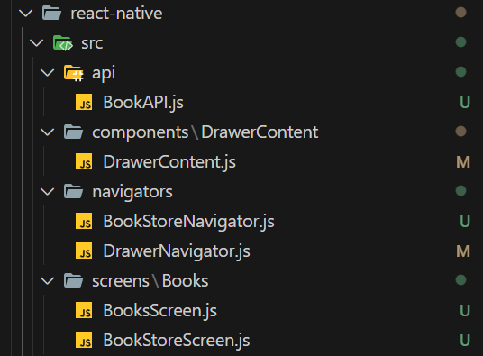
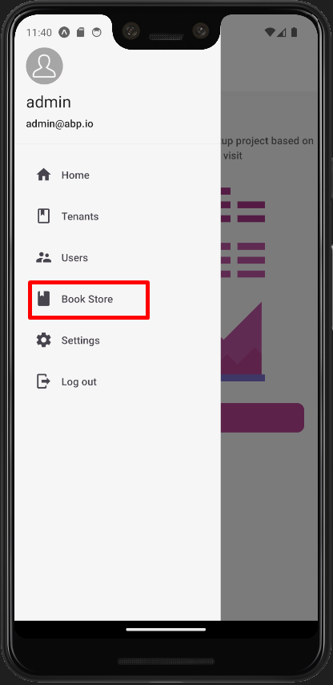

# Mobile Application Development Tutorial - React Native

## About This Tutorial

- This tutorial assumes that you have completed the [Web Application Development tutorial](../part-1.md) and built an ABP based application named `Acme.BookStore`. In this tutorial, we will only focus on the UI side of the `Acme.BookStore` application and will implement the CRUD operations.
- Before start please be sure the [React Native Development Environment](https://docs.abp.io/en/commercial/latest/getting-started-react-native) is ready on your machine.

## Download the Source Code

You can use the following link to download the source code of the application described in this article:

- [Acme.BookStore]()

> If you encounter the "filename too long" or "unzip" error on Windows, please see [this guide](https://docs.abp.io/en/abp/latest/KB/Windows-Path-Too-Long-Fix).

## The Book List Page

- In react native there is no dynamic proxy generation, that's why we need to create BookAPI proxy manually under the `src/api` folder.

```js
./src/api/BookAPI.js

import api from './API';

export const getList = () => api.get('/api/app/book').then(({ data }) => data);

export const get = id => api.get(`/api/app/book/${id}`).then(({ data }) => data);

export const create = input => api.post('/api/app/book', input).then(({ data }) => data);

export const update = (input, id) => api.put(`/api/app/book/${id}`, input).then(({ data }) => data);
```

- Add Book Store menu item to navigation

  - Add Screen to DrawerNavigator

  ```js
  ./src/navigators/DrawerNavigator.js

  //Other imports..
  import BookStoreStackNavigator from './BookStoreNavigator';

  const Drawer = createDrawerNavigator();

  export default function DrawerNavigator() {
    return (
      <Drawer.Navigator
        initialRouteName="Home"
        drawerContent={DrawerContent}
        defaultStatus="closed"
      >
        {/*Added Screen*/}
        <Drawer.Screen
          name="BookStoreStack"
          component={BookStoreStackNavigator}
          options={{ header: () => null }}
        />
        {/*Added Screen*/}
      </Drawer.Navigator>
    );
  }
  ```

  - Create BookStoreStackNavigator.js File

  ```js
  ./src/navigators/BookStoreStackNavigator.js file

  import React from "react";
  import { SafeAreaView } from "react-native-safe-area-context";
  import { createNativeStackNavigator } from "@react-navigation/native-stack";
  import i18n from "i18n-js";

  import HamburgerIcon from "../components/HamburgerIcon/HamburgerIcon";

  import BookStoreScreen from "../screens/Books/BookStoreScreen";

  const Stack = createNativeStackNavigator();

  export default function BookStoreStackNavigator() {
    return (
      <SafeAreaView style={{ flex: 1 }}>
        <Stack.Navigator initialRouteName="BookStore">
          <Stack.Screen
            name="BookStore"
            component={BookStoreScreen}
            options={({ navigation }) => ({
              title: i18n.t("BookStore::Menu:BookStore"),
              headerLeft: () => <HamburgerIcon navigation={navigation} />,
            })}
          />
        </Stack.Navigator>
      </SafeAreaView>
    );
  }
  ```

  - Add BookStoreStack to screens object

  ```js
  ./src/components/DrawerContent/DrawerContent.js

  // Imports..

  const screens = {
    HomeStack: { label: '::Menu:Home', iconName: 'home' },
    DashboardStack: {
        label: '::Menu:Dashboard',
        requiredPolicy: 'BookStore.Dashboard',
        iconName: 'chart-areaspline',
    },
    UsersStack: {
        label: 'AbpIdentity::Users',
        iconName: 'account-supervisor',
        requiredPolicy: 'AbpIdentity.Users',
    },

    //Add this property
    BookStoreStack: {
        label: 'BookStore::Menu:BookStore',
        iconName: 'book',
    },
    //Add this property

    TenantsStack: {
        label: 'Saas::Tenants',
        iconName: 'book-outline',
        requiredPolicy: 'Saas.Tenants',
    },
    SettingsStack: { label: 'AbpSettingManagement::Settings', iconName: 'cog', navigation: null },
  };

  // Other codes..
  ```

  ### Changes

  

  ### Book Store Menu Item

  

- `Create Book List page`

  - Create BookStoreScreen.js file

  ```js
  ./src/screens/BookStore/BookStoreScreen.js

  import React from 'react';
  import i18n from 'i18n-js';
  import { BottomNavigation } from 'react-native-paper';

  import BooksScreen from './Books/BooksScreen';

  const BooksRoute = () => <BooksScreen />;

  function BookStoreScreen({ navigation }) {
    const [index, setIndex] = React.useState(0);
    const [routes] = React.useState([
      {
        key: 'books',
        title: i18n.t('BookStore::Menu:Books'),
        focusedIcon: 'book',
        unfocusedIcon: 'book-outline',
      },
    ]);

    const renderScene = BottomNavigation.SceneMap({
      books: BooksRoute,
    });

    return (
      <BottomNavigation
        navigationState={{ index, routes }}
        onIndexChange={setIndex}
        renderScene={renderScene}
      />
    );
  }

  export default BookStoreScreen;
  ```

  ```js
  ./src/screens/BookStore/Books/BooksScreen.js

  import React from 'react';
  import { useSelector } from 'react-redux';
  import { View } from 'react-native';
  import { useTheme, List } from 'react-native-paper';
  import { getBooks } from '../../api/BookAPI';
  import i18n from 'i18n-js';

  import DataList from '../../components/DataList/DataList';
  import { createAppConfigSelector } from '../../store/selectors/AppSelectors';

  function BooksScreen({ navigation }) {
  const theme = useTheme();
  const currentUser = useSelector(createAppConfigSelector())?.currentUser;

  return (
    <View style={{ flex: 1, backgroundColor: theme.colors.background }}>
      {currentUser?.isAuthenticated && (
          <DataList
            navigation={navigation}
            fetchFn={getBooks}
            render={({ item }) => (
                <List.Item
                  key={item.id}
                  title={item.name}
                  description={i18n.t('BookStore::Enum:BookType.' + item.type)}
                />
            )}
          />
      )}
    </View>
   );
  }

  export default BooksScreen;
  ```

  - `getBooks` function used for fetching books from the server.
  - `i18n` api localize given key. It use incoming resource from `application-configuration` endpoint.
  - `DataList` component takes `proxy method` for the fetch data and run the logic for lazy loading etc.

  ### Book List Page

  
