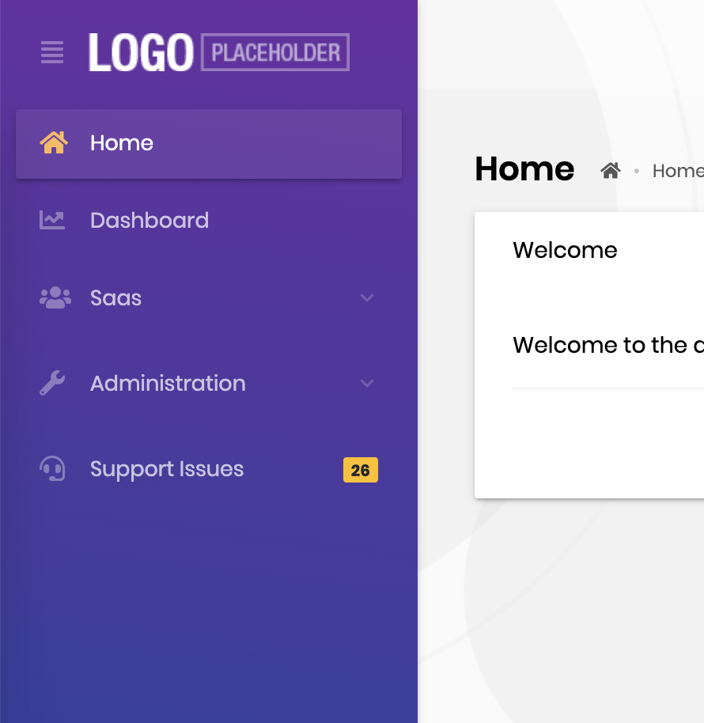

# Customizing Lepton Theme

## Adding Custom Style

There is a `customStyle` boolean configuration in `ThemeLeptonModule`'s `forRoot` method. If this configuration is true, the style selection box is not included in the theme settings form and `ThemeLeptonModule` does not load its own styles. In this case, a custom style file must be added to the styles array in `angular.json` or must be imported by `style.scss`.

> Only angular project styles can be changed in this way. If the authorization flow is authorization code flow, MVC pages (login, profile, etc) are not affected by this change.

Custom style implementation can be done with the following steps

Set `customStyle` property to `true` where is `ThemeLeptonModule` imported with `forRoot` method. 
```javascript
// app.module.ts
ThemeLeptonModule.forRoot({
    customStyle: true
})
```
Import your style file to `src/style.scss`
```css
/* style.scss */
import 'your-custom-style';
```
Or add your style file to the `styles` arrays which in `angular.json` file 
```json
// angular.json
{
   // other configurations 
  "projects": {
    "YourProject": {
      // other configurations
      "architect": {
        "build": {
            "styles": [
              // other styles  
              "your-custom-style-file"
            ],
          },
        },
        "test": {
          "options": {
            "styles": [
               // other styles  
              "your-custom-style-file"
            ],
          }
        },
      }
    }
  }
}
```


## Inserting Custom Content To Lepton Menu

Lepton menu can take custom content both before and after the menu items displayed. In order to achieve this, pass a component as content through the parameters of `ThemeLeptonModule.forRoot` when you import the module in your root module, i.e. `AppModule`. Let's take a look at some examples.


### Placing Custom Content Before & After Menu Items

First step is to create a component which will serve as the custom content.

```js
@Component({
  template: `<a href="https://support.my-domain.com">
    <span class="lp-icon"><i class="fas fa-headset"></i></span>
    <span class="lp-text">Support Issues</span>
    <div class="d-flex justify-content-end">
      <span class="badge badge-pill badge-warning"></span>
    </div>
  </a>`,
})
export class SupportLinkComponent {
  issueCount$ = of(26); // dummy count, replace this with an actual service
}

@NgModule({
  declarations: [SupportLinkComponent],
  imports: [CommonModule],
})
export class SupportLinkModule {}
```

Now, pass this component as `contentAfterRoutes` option to `ThemeLeptonModule`.

```js
@NgModule({
  imports: [
    // other imports are removed for sake of brevity
    SupportLinkModule,
    ThemeLeptonModule.forRoot({
      contentAfterRoutes: [SupportLinkComponent],
    })
  ],
})
export class AppModule {}
```

If you start the dev server, you must see the inserted content as follows:




Placing the content before menu items is straightforward: Just replace `contentAfterRoutes` with `contentBeforeRoutes`.


### Placing a Search Input Before Menu Items

The Lepton package has a search component designed to work with the routes in the menu. You can simply import the module and pass the component as `contentBeforeRoutes` option to `ThemeLeptonModule`.

```js
import { MenuSearchComponent, MenuSearchModule } from '@volo/abp.ng.theme.lepton/extensions';

@NgModule({
  imports: [
    // other imports are removed for sake of brevity

    MenuSearchModule.forRoot({
      limit: 3 // search result limit (default: Infinity)
    }),
    ThemeLeptonModule.forRoot({
      contentBeforeRoutes: [MenuSearchComponent],
    })
  ],
})
export class AppModule {}
```

Here is how the search input works:


Please note that the **search component filters only the routes and cannot hide custom content** inserted to the menu. If you need both, you will have to build your own search input.
