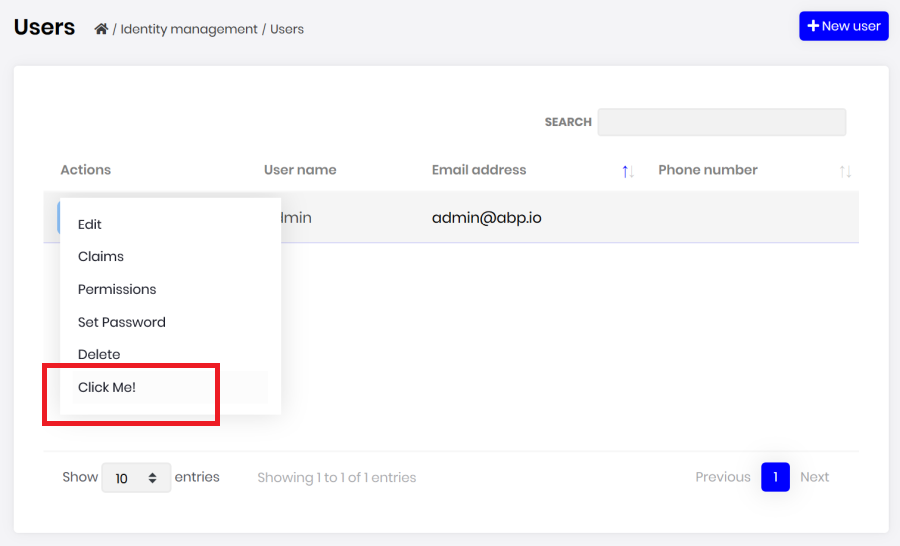

# Entity Action Extensions for Angular UI

## Introduction

Entity action extension system allows you to add a new action to the action menu for an entity. A "Click Me" action was added to the user management page below:



You can take any action (open a modal, make an HTTP API call, redirect to another page... etc) by writing your custom code. You can access to the current entity in your code.

## How to Set Up

In this example, we will add a "Click Me!" action and execute a JavaScript code for the user management page of the [Identity Module](../../modules/identity.md).

### Step 1. Create Entity Action Contributors

The following code prepares a constant named `identityActionContributors`, ready to be imported and used in your root module:

```js
// entity-action-contributors.ts

import { ActionList, EntityAction } from '@volo/abp.commercial.ng.ui';
import { Identity } from '@volo/abp.ng.identity';
import { IdentityActionContributors } from '@volo/abp.ng.identity.config';

const alertUserName = new EntityAction<Identity.User>({
  text: 'Click Me!',
  action: data => {
    // Replace alert with your custom code
    alert(data.record.userName);
  },
});

export function alertUserNameContributor(actionList: ActionList<Identity.User>) {
  actionList.addTail(alertUserName);
}

export const identityActionContributors: IdentityActionContributors = {
  // 'Identity.UsersComponent' indicates where this action will be placed
  'Identity.UsersComponent': [
    alertUserNameContributor,
    // You can add more contributors here
  ],
};
```

The list of actions, conveniently named as `actionList`, is a **doubly linked list**. That is why we have used the `addTail` method, which adds the given value to the end of the list. You may find [all available methods here](../../Common/Utils/Linked-List).

> **Important Note:** AoT compilation does not support function calls in decorator metadata. This is why we have defined `alertUserNameContributor` as an exported function declaration here. Please do not forget exporting your contributor callbacks and forget about lambda functions (a.k.a. arrow functions). Please refer to [AoT metadata errors](https://angular.io/guide/aot-metadata-errors#function-calls-not-supported) for details.

### Step 2. Import and Use Entity Action Contributors

Import `identityActionContributors` in your root module and pass it to the static `forRoot` method of `IdentityConfigModule` as seen below:

```js
import { IdentityConfigModule } from '@volo/abp.ng.identity.config';
import { identityActionContributors } from './entity-action-contributors';

@NgModule({
  imports: [
    // Other imports
    
    IdentityConfigModule.forRoot({
      entityActionContributors: identityActionContributors,
    }),
    
    // Other imports
  ],
  providers: [],
  declarations: [AppComponent],
  bootstrap: [AppComponent],
})
export class AppModule {}
```

That is it, `alertUserName` entity action will be added as the last action on the grid dropdown in the users page (`UsersComponent`) of the `IdentityModule`.

## API

### EntityData\<R = any\>

`EntityData` is the shape of the parameter passed to all callbacks or predicates in an `EntityAction`.

It has the following properties:

* **record** is the row data, i.e. current value rendered in the table.

* **index** is the table index where the record is at.

* **getInjected** is the equivalent of [Injector.get](https://angular.io/api/core/Injector#get). You can use it to reach injected dependencies of `GridActionsComponent`, including, but not limited to, its parent component.

  ```js
  {
    text: 'Click Me!',
    action: data => {
      const restService = data.getInjected(RestService);
      
      // Use restService public props and methods here
    },
    visible: data => {
      const usersComponent = data.getInjected(UsersComponent);
      
      // Use usersComponent public props and methods here
    },
  }
  ```

### EntityActionOptions\<R = any\>

`EntityActionOptions` is the type that defines required and optional properties you have to pass in order to create an entity action.

Its type definition is as follows:

```js
type EntityActionOptions<R = any> = {
  action: EntityActionCallback<R>;
  text: string;
  icon?: string;
  permission?: string;
  visible?: EntityActionPredicate<R>;
}
```

As you see, passing `action` and `text` is enough to create an entity action. Here is what each property is good for:

* **action** is a callback that is called when the grid action is clicked. (_required_)
* **text** is the button text which will be localized. (_required_)
* **icon** is the classes that define an icon to be placed before the text. (_default:_ `''`)
* **permission** is the permission context which will be used to decide if this type of grid action should be displayed to the user or not. (_default:_ `undefined`)
* **visible** is a predicate that will be used to decide if the current record should have this grid action or not. (_default:_ `() => true`)

You may find a full example below.

### EntityAction\<R = any\>

`EntityAction` is the class that defines your entity actions. It takes an `EntityActionOptions` and sets the default values to the properties, creating an entity action that can be passed to an entity contributor.

```
const options: EntityActionOptions<Identity.User> = {
  action: data => {
    const component = data.getInjected(UsersComponent);
    component.unlock(data.record.id);
  },
  text: 'AbpIdentity::Unlock',
  icon: 'fa fa-unlock',
  permission: 'AbpIdentity.Users.Update',
  visible: data => !data.record.isLockedOut,
};

const action = new EntityAction<Identity.User>(options);
```

It also has two static methods to create its instances:

* **EntityAction.create\<R = any\>\(options: EntityActionOptions\<R\>\)** is used to create an instance of `EntityAction`.
* **EntityAction.createMany\<R = any\>\(options: EntityActionOptions\<R\>\[\]\)** is used to create multiple instances of `EntityAction` with given array of `EntityActionOptions`.

### ActionList\<R = any\>

`ActionList` is the list of actions passed to every action contributor callback as the first parameter named `actionList`. It is a **doubly linked list**. You may find [all available methods here](../../Common/Utils/Linked-List).

The items in the list will be displayed according to the liked list order, i.e. from head to tail. If you want to re-order them, all you have to do is something like this:

```js
export function reorderUserContributors(actionList: ActionList<Identity.User>) {
  const unlockActionNode = actionList.dropByValue(
    'AbpIdentity::Unlock',
    (action, text) => action.text === text,
  );
  
  actionList.addHead(unlockActionNode.value);
}
```

### EntityActionContributorCallback\<R = any\>

`EntityActionContributorCallback` is the type that you can pass as entity action contributor callbacks to static `forRoot` methods of the modules.

```js
// app.module.ts

export function lockUserContributor(actionList: ActionList<Identity.User>) {
  actionList.add(lockUser).byIndex(2);
  
  // lockUser should have EntityActionContributorCallback<Identity.User> type
}

@NgModule({
  imports: [
    // Other imports
    
    IdentityConfigModule.forRoot({
      entityActionContributors: {
        'Identity.UsersComponent': [ lockUserContributor ],
      },
    }),
    
    // Other imports
  ],
  providers: [],
  declarations: [AppComponent],
  bootstrap: [AppComponent],
})
export class AppModule {}
```

